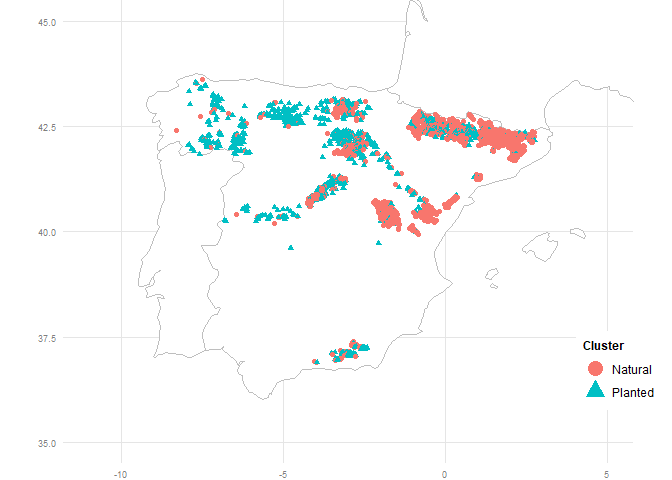
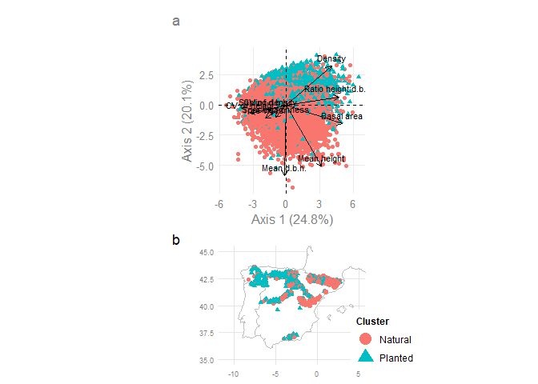

Calculate management legacies, tree demography and climate data
================

<style type="text/css">
pre {
  font-size: 10px
}
</style>

``` r
library(tidyverse)
library(here)
library(testthat)
library(factoextra)
library(RColorBrewer)
library(ggh4x)
library(sf)
library(patchwork)
library(janitor)
library(gt)
```

``` r
tree23 <- read_csv(
  file = here("01-data", "ifn", "tree23.csv")
  )

Pme2 <- read_csv(
  here("01-data", "ifn", "Pme2_clean.csv")
  )

Pme3 <- read_csv(
  here("01-data", "ifn", "Pme3_clean.csv")
)
```

# Forest type definition

``` r
map(tree23 |> select(Cla3, Subclase3),
    ~levels(as.factor(.x)))
```

    ## $Cla3
    ## [1] "A"
    ## 
    ## $Subclase3
    ## [1] "1"  "3C"

``` r
# only pinus sylvestris trees (Psy)
# I select those plots of pinus sylvestris and
# where the % of pinus sylvestris is >= 50%
Psy23 <- tree23 |> 
  group_by(IDPC3) |> 
  mutate(
    # initial basal area
    AB2m2ha.tot.plot = sum(AB2m2ha, na.rm = T),
  ) |> 
  group_by(IDPC3, sppcompa) |> 
  mutate(
    AB2m2ha.plot = sum(AB2m2ha, na.rm = T), 
    AB2m2ha.rel.plot = AB2m2ha.plot * 100 / AB2m2ha.tot.plot
  ) |> 
  filter(
    # Psy = 21; Ppa = 26; Pni = 25; Pha = 24
    sppcompa == "021" & AB2m2ha.rel.plot >= 50
  )

nrow(Psy23) / nrow(tree23) # 14% Psy
```

    ## [1] 0.1469545

``` r
#  16% Ppa
#  7% Pni
#  9% Pha

# all trees in plots where there is more than one Psy
Psy23 <- Psy23 |> 
  group_by(IDPC3) |> 
  mutate(ntrees = length(IDPC3)) |> 
  filter(ntrees > 1)
```

# Management legacy

``` r
# forest structure, sp richness, regeneration
# join with information from Ceballos
planted <- read_tsv(
  here("01-data", "ifn", "Plotcode_RP.txt"),
  col_types = cols(.default = "c",
                   PLOTCODE = col_integer())
)

# names(planted)

dat <- planted |>
  dplyr::select(PLOTCODE, Psy) |>
  mutate(Psy = if_else(is.na(Psy), "A", Psy))

test_that("NA is natural", {
  expect_equal(sum(is.na(planted$Psy)) + sum(planted$Psy == "A", na.rm = T),
               sum(dat$Psy == "A", na.rm = T))
})
```

    ## Test passed 🥇

``` r
Psy23_planted <- Psy23 |>
  left_join(dat, by = c("Plotcode3" = "PLOTCODE"))

# A = natural
# table(Psy23_planted$Psy, useNA = "always")

Psy23_planted <- Psy23_planted |> 
  mutate(
    hdbh2 = h2 * 1000 / dbh2,
    hdbh3 = h3 * 1000 / dbh3,
    Psy = factor(Psy, levels = c("P", "A"), 
                 labels = c("Planted", "Natural"))
  )

summary(Psy23_planted$Psy)
```

    ## Planted Natural 
    ##   46087   96201

``` r
# richness: I group by plot and species and 
# select only the alive trees from ifn2
table(tree23$state3)
```

    ## 
    ##     MA  MA-nc     MP  MP-nc      R      V   V-nc 
    ##  97473      3  26031    626 264260 577089   3117

``` r
spp2 <- tree23 |>
  filter(state3 == "V" | state3 == "MA" | state3 == "MP") |>
  group_by(Plotcode2, sppcompa) |>
  summarise(NoTrees2 = length(Plotcode2))

# names(spp2)

sppriqueza2 <- spp2 |>
  group_by(Plotcode2) |>
  summarise(Riqueza2 = length(Plotcode2))

# species richness ifn3
table(tree23$state3)
```

    ## 
    ##     MA  MA-nc     MP  MP-nc      R      V   V-nc 
    ##  97473      3  26031    626 264260 577089   3117

``` r
spp3 <- tree23 |>
  filter(state3 == "V" | state3 == "R") |>
  group_by(Plotcode3, sppcompa) |>
  summarise(NoTrees3 = length(Plotcode3))

# names(spp3)

sppriqueza3 <- spp3 |>
  group_by(Plotcode3) |>
  summarise(Riqueza3 = length(Plotcode3))

Psy2 <- Psy23_planted |>
  group_by(Plotcode2) |>
  summarise(type2 = first(Psy),
            IDPC3 = first(IDPC3),
            ba_ha2 = sum(AB2m2ha, na.rm = TRUE),
            dens2 = sum(dens2, na.rm = TRUE),
            mdbh2 = mean(dbh2, na.rm = TRUE),
            sddbh2 = sd(dbh2, na.rm = TRUE),
            mh2 = mean(h2, na.rm = TRUE),
            sdh2 = sd(h2, na.rm = TRUE),
            mhdbh2 = mean(hdbh2, na.rm = TRUE),
            mqH2 = mean(Calidad2, na.rm = TRUE),
            cvdbh2 = sddbh2 / mdbh2,
            cvh2 = sdh2 / mh2) |>
  dplyr::select(!c(sddbh2, sdh2))

Psy3 <- Psy23_planted |>
  group_by(Plotcode3) |>
  summarise(type3 = first(Psy),
            IDPC3 = first(IDPC3),
            ba_ha3 = sum(AB3m2ha, na.rm = TRUE),
            dens3 = sum(dens3, na.rm = TRUE),
            mdbh3 = mean(dbh3, na.rm = TRUE),
            sddbh3 = sd(dbh3, na.rm = TRUE),
            mh3 = mean(h3, na.rm = TRUE),
            sdh3 = sd(h3, na.rm = TRUE),
            mhdbh3 = mean(hdbh3, na.rm = TRUE),
            mqH3 = mean(Calidad3, na.rm = TRUE),
            cvdbh3 = sddbh3 / mdbh3,
            cvh3 = sdh3 / mh3) |>
  dplyr::select(!c(sddbh3, sdh3))

# map(Psy2, ~sum(is.na(.)))
# map(Psy3, ~sum(is.na(.)))

Psy2 <- Psy2 |> 
  mutate(
    type2 = recode(type2, Planted = "1", Natural = "0")
  )
summary(Psy2$type2)
```

    ##    1    0 
    ## 1441 3926

``` r
Psy3 <- Psy3 |> 
  mutate(
    type3 = recode(type3, Planted = "1", Natural = "0")
  )
summary(Psy3$type3)
```

    ##    1    0 
    ## 1440 3926

``` r
Psy2 <- Psy2 |>
  left_join(sppriqueza2, by = "Plotcode2")
glimpse(Psy2)
```

    ## Rows: 5,367
    ## Columns: 12
    ## $ Plotcode2 <dbl> 10067, 10094, 10103, 10116, 10123, 10126, 10135, 10153, 1015…
    ## $ type2     <fct> 1, 1, 1, 1, 0, 1, 1, 1, 1, 0, 1, 1, 1, 1, 1, 1, 1, 1, 0, 0, …
    ## $ IDPC3     <chr> "10067A1", "10094A1", "10103A1", "10116A1", "10123A1", "1012…
    ## $ ba_ha2    <dbl> 4.409798, 14.924834, 22.244708, 13.458388, 19.272495, 21.685…
    ## $ dens2     <dbl> 74.27231, 247.57436, 640.15655, 119.40158, 208.24540, 615.39…
    ## $ mdbh2     <dbl> 290.7500, 284.6000, 223.2759, 401.5909, 350.0938, 239.0652, …
    ## $ mh2       <dbl> 10.125000, 13.700000, 15.034483, 12.454545, 19.906250, 12.10…
    ## $ mhdbh2    <dbl> 36.26612, 49.96737, 70.87539, 31.84902, 57.46009, 53.04158, …
    ## $ mqH2      <dbl> 2.000000, 2.000000, 2.068966, 2.090909, 2.125000, 2.043478, …
    ## $ cvdbh2    <dbl> 0.31343216, 0.21566813, 0.28037706, 0.28235858, 0.16789753, …
    ## $ cvh2      <dbl> 0.28043992, 0.13780523, 0.16071099, 0.21201835, 0.18371327, …
    ## $ Riqueza2  <int> 1, 2, 2, 3, 3, 4, 2, 1, 2, 2, 4, 2, 3, 2, 3, 2, 2, 5, 3, 2, …

``` r
Psy3 <- Psy3 |>
  left_join(sppriqueza3, by = "Plotcode3")
glimpse(Psy3)
```

    ## Rows: 5,366
    ## Columns: 12
    ## $ Plotcode3 <dbl> 10067, 10094, 10103, 10116, 10123, 10126, 10135, 10153, 1015…
    ## $ type3     <fct> 1, 1, 1, 1, 0, 1, 1, 1, 1, 0, 1, 1, 1, 1, 1, 1, 1, 1, 0, 0, …
    ## $ IDPC3     <chr> "10067A1", "10094A1", "10103A1", "10116A1", "10123A1", "1012…
    ## $ ba_ha3    <dbl> 6.123150, 19.390306, 15.466808, 15.311306, 1.903539, 23.6540…
    ## $ dens3     <dbl> 84.88264, 263.27764, 477.46483, 115.44039, 28.29421, 436.579…
    ## $ mdbh3     <dbl> 299.5000, 313.4167, 213.0000, 438.5833, 289.5000, 277.5208, …
    ## $ mh3       <dbl> 12.333333, 15.250000, 14.860000, 17.333333, 13.750000, 15.41…
    ## $ mhdbh3    <dbl> 42.10745, 50.36489, 71.35980, 40.76423, 48.17368, 57.89454, …
    ## $ mqH3      <dbl> 2.000000, 3.368421, 2.100000, 2.000000, 2.000000, 2.720000, …
    ## $ cvdbh3    <dbl> 0.16947663, 0.21478268, 0.19229229, 0.26986840, 0.21005590, …
    ## $ cvh3      <dbl> 0.15943655, 0.12280609, 0.15845923, 0.17146687, 0.07713892, …
    ## $ Riqueza3  <int> 1, 2, 2, 3, 3, 5, 2, 1, 2, 2, 4, 4, 3, 2, 3, 2, 2, 5, 3, 2, …

``` r
# all species and size classes
pPme2 <- Pme2 |> 
  group_by(Plotcode2) |> 
  summarise(Pmedens2 = sum(Pmedens_ha2, na.rm = T)) 

pPme3 <- Pme3 |>
  group_by(Plotcode3) |> 
  summarise(Pmedens3 = sum(Pmedens_ha3, na.rm = T)) 

Psy2 <- Psy2 |> 
  left_join(pPme2, by = "Plotcode2")

Psy3 <- Psy3 |>
  left_join(pPme3, by = "Plotcode3")

# summary(Psy2$Pmedens2)
# summary(Psy3$Pmedens3)

Psy2 <- Psy2 |> 
  mutate(Pmedens2 = replace_na(Pmedens2, 0))

Psy3 <- Psy3 |> 
  mutate(Pmedens3 = replace_na(Pmedens3, 0))

# summary(Psy2$Pmedens2)
# summary(Psy3$Pmedens3)

Psy23_final <- full_join(Psy2, Psy3, by = "IDPC3")

# names(Psy23_final)

# nrow(Psy23_final)

test_that("sum is number of NA", {
  expect_equal(sum(is.na(Psy23_final$Plotcode2)), 1)
  })
```

    ## Test passed 🌈

``` r
test_that("type2 == type3", {
  expect_equal(identical(Psy23_final[["type2"]],
                         Psy23_final[["type3"]]), TRUE)
})
```

    ## Test passed 😸

``` r
Psy23_final <- Psy23_final |> 
  drop_na(Plotcode2)

test_that("Plotcode2 == Plotcode3", {
  expect_equal(identical(Psy23_final[["Plotcode2"]],
                         Psy23_final[["Plotcode3"]]), TRUE)
})
```

    ## Test passed 🌈

``` r
# map(Psy23_final, ~sum(is.na(.)))

# nrow(Psy23_final)
Psy23_final <- Psy23_final |>
  drop_na()
# nrow(Psy23_final)
table(Psy23_final$type2)
```

    ## 
    ##    1    0 
    ## 1376 3787

``` r
# long format
Psy23_final_ba_long <- Psy23_final |>
  filter(mqH3 <= 6 ) |> 
  pivot_longer(
    cols = c(
      "ba_ha2", "ba_ha3"
    ),
    names_to = "ba_ifn",
    values_to = "Basal area"
  ) |> 
  dplyr::select(
    IDPC3, ba_ifn, "Basal area", type2
    )
Psy23_final_dens_long <- Psy23_final |>
  filter(mqH3 <= 6 ) |> 
  pivot_longer(
    cols = c(
      "dens2", "dens3"
    ),
    names_to = "dens_ifn",
    values_to = "Density"
  ) |> 
  dplyr::select(
    dens_ifn, Density
    )
Psy23_final_mdbh_long <- Psy23_final |>
  filter(mqH3 <= 6 ) |> 
  pivot_longer(
    cols = c(
      "mdbh2", "mdbh3"
    ),
    names_to = "mdbh_ifn",
    values_to = "Mean d.b.h."
  ) |> 
  dplyr::select(
    mdbh_ifn, "Mean d.b.h."
    )
Psy23_final_mh_long <- Psy23_final |>
  filter(mqH3 <= 6 ) |> 
  pivot_longer(
    cols = c(
      "mh2", "mh3"
    ),
    names_to = "mh_ifn",
    values_to = "Mean height"
  ) |> 
  dplyr::select(
    mh_ifn, "Mean height"
  )
Psy23_final_mhdbh_long <- Psy23_final |>
  filter(mqH3 <= 6 ) |> 
  pivot_longer(
    cols = c(
      "mhdbh2", "mhdbh3"
    ),
    names_to = "mhdbh_ifn",
    values_to = "Ratio height:d.b.h."
  ) |> 
  dplyr::select(
    mhdbh_ifn, "Ratio height:d.b.h."
  )
Psy23_final_cvdbh_long <- Psy23_final |>
  filter(mqH3 <= 6 ) |> 
  pivot_longer(
    cols = c(
      "cvdbh2", "cvdbh3"
    ),
    names_to = "cvdbh_ifn",
    values_to = "CV of d.b.h."
  ) |> 
  dplyr::select(
    cvdbh_ifn, "CV of d.b.h."
  )
Psy23_final_cvh_long <- Psy23_final |>
  filter(mqH3 <= 6 ) |> 
  pivot_longer(
    cols = c(
      "cvh2", "cvh3"
    ),
    names_to = "cvh_ifn",
    values_to = "CV of height"
  ) |> 
  dplyr::select(
    cvh_ifn, "CV of height"
  )
Psy23_final_Pmedens_long <- Psy23_final |>
  filter(mqH3 <= 6 ) |> 
  pivot_longer(
    cols = c(
      "Pmedens2", "Pmedens3"
    ),
    names_to = "Pmedens_ifn",
    values_to = "Sapling density"
  ) |> 
  dplyr::select(
    Pmedens_ifn, "Sapling density"
  )
Psy23_final_Riqueza_long <- Psy23_final |>
  filter(mqH3 <= 6 ) |> 
  pivot_longer(
    cols = c(
      "Riqueza2", "Riqueza3"
    ),
    names_to = "Riqueza_ifn",
    values_to = "Species richness"
  ) |> 
  dplyr::select(
    Riqueza_ifn, "Species richness"
  )
Psy23_final_mqH_long <- Psy23_final |>
  filter(mqH3 <= 6 ) |> 
  pivot_longer(
    cols = c(
      "mqH2", "mqH3"
    ),
    names_to = "mqH_ifn",
    values_to = "Tree vigour"
  ) |> 
  dplyr::select(
    mqH_ifn, "Tree vigour"
  )

Psy23_final_long <- bind_cols(
  Psy23_final_ba_long,
  Psy23_final_dens_long,
  Psy23_final_mdbh_long,
  Psy23_final_mh_long,
  Psy23_final_mhdbh_long,
  Psy23_final_cvdbh_long,
  Psy23_final_cvh_long,
  Psy23_final_Pmedens_long,
  Psy23_final_Riqueza_long,
  Psy23_final_mqH_long
)

# for boxplot cluster x origin
Psy23_final_long_str <- Psy23_final_long

test_that("Plotcode2 == Plotcode3", {
  expect_equal(unname(map_dbl(Psy23_final_long, ~sum(is.na(.)))), rep(0, length(names(Psy23_final_long))))
               })
```

    ## Test passed 🥳

# PCA and clustering: only planted forests

``` r
# names(Psy23_final_long)

# type = 1 is planted
Psy23_final_long <- Psy23_final_long |> 
  mutate(
    type2 = str_replace(type2, "1", "planted"),
    type2 = str_replace(type2, "0", "natural"),
  )

# ja: clusters para plantado y natural por serapado
table(Psy23_final_long$type2, useNA = "always")
```

    ## 
    ## natural planted    <NA> 
    ##    7574    2750       0

``` r
nrow(Psy23_final_long |> 
       distinct(IDPC3))
```

    ## [1] 5162

``` r
Psy23_final_long_num <- Psy23_final_long |>
  dplyr::select(
    !c(ends_with("ifn"), IDPC3, type2)
    )
glimpse(Psy23_final_long_num)
```

    ## Rows: 10,324
    ## Columns: 10
    ## $ `Basal area`          <dbl> 4.409798, 6.123150, 14.924834, 19.390306, 22.244…
    ## $ Density               <dbl> 74.27231, 84.88264, 247.57436, 263.27764, 640.15…
    ## $ `Mean d.b.h.`         <dbl> 290.7500, 299.5000, 284.6000, 313.4167, 223.2759…
    ## $ `Mean height`         <dbl> 10.125000, 12.333333, 13.700000, 15.250000, 15.0…
    ## $ `Ratio height:d.b.h.` <dbl> 36.26612, 42.10745, 49.96737, 50.36489, 70.87539…
    ## $ `CV of d.b.h.`        <dbl> 0.31343216, 0.16947663, 0.21566813, 0.21478268, …
    ## $ `CV of height`        <dbl> 0.28043992, 0.15943655, 0.13780523, 0.12280609, …
    ## $ `Sapling density`     <dbl> 2291.8312, 6238.8738, 2291.8312, 1273.2395, 4710…
    ## $ `Species richness`    <int> 1, 1, 2, 2, 2, 2, 3, 3, 3, 3, 4, 5, 2, 2, 1, 1, …
    ## $ `Tree vigour`         <dbl> 2.000000, 2.000000, 2.000000, 3.368421, 2.068966…

``` r
pca_Psy <- prcomp(Psy23_final_long_num, scale = TRUE)

PCAPsy <- fviz_pca_biplot(pca_Psy, label = "var", 
                          col.ind = "grey",
                          col.var = "black",
                          title = "",
                          labelsize = 3,
                          habillage = Psy23_final_long$type2)

# https://uc-r.github.io/kmeans_clustering
Psy23_final_long_num_sc <- scale(Psy23_final_long_num)

set.seed(123)
k3 <- kmeans(Psy23_final_long_num_sc, centers = 2, nstart = 25)

myColors <- brewer.pal(4, "Paired")[c(2, 4)]

cluster_ifn23 <- fviz_cluster(
  k3, data = Psy23_final_long_num_sc,
  geom = "point"
  ) + 
  ggtitle(label = "") +
  scale_color_manual(name = "Cluster",
                     values = myColors, 
                    labels = c("C1", "C2")) +
  scale_fill_manual(name = "Cluster",
                    values = myColors, 
                    labels = c("C1", "C2")) +
  scale_shape_manual(name = "Cluster",
                     values = c(19, 17),
                     labels = c("C1", "C2")) +
  scale_x_continuous(name = "Axis 1 (24.8%)") +
  scale_y_continuous(name = "Axis 2 (20.1%)")
cluster_ifn23
```

<!-- -->

``` r
# determining number of clusters
# set.seed(123)
# fviz_nbclust(Psy23_final_long_num_sc, kmeans, method = "wss")
# 
# ggsave( 
#   here("03-results", "si_figures", "k_means_elbow.png"),
#   width = 6, height = 4
# )

# add the cluster number to the original data
Psy23_final_long <- Psy23_final_long |>
  mutate(
    k3 = k3$cluster
  )
table(Psy23_final_long$k3)
```

    ## 
    ##    1    2 
    ## 6365 3959

``` r
# names(Psy23_final_long)

# for the contingency table
Psy23_final_long_k <- Psy23_final_long

# statistical test
Psy23_final_long$k3 <- as.factor(Psy23_final_long$k3)
levels(Psy23_final_long$k3)
```

    ## [1] "1" "2"

``` r
wilcox.test(`Basal area` ~ k3, data = Psy23_final_long)
```

    ## 
    ##  Wilcoxon rank sum test with continuity correction
    ## 
    ## data:  Basal area by k3
    ## W = 1571155, p-value < 2.2e-16
    ## alternative hypothesis: true location shift is not equal to 0

``` r
wilcox.test(Density ~ k3, data = Psy23_final_long)
```

    ## 
    ##  Wilcoxon rank sum test with continuity correction
    ## 
    ## data:  Density by k3
    ## W = 4763948, p-value < 2.2e-16
    ## alternative hypothesis: true location shift is not equal to 0

``` r
wilcox.test(`Mean d.b.h.` ~ k3, data = Psy23_final_long)
```

    ## 
    ##  Wilcoxon rank sum test with continuity correction
    ## 
    ## data:  Mean d.b.h. by k3
    ## W = 11675592, p-value = 3.504e-10
    ## alternative hypothesis: true location shift is not equal to 0

``` r
wilcox.test(`Mean height` ~ k3, data = Psy23_final_long)
```

    ## 
    ##  Wilcoxon rank sum test with continuity correction
    ## 
    ## data:  Mean height by k3
    ## W = 5572396, p-value < 2.2e-16
    ## alternative hypothesis: true location shift is not equal to 0

``` r
wilcox.test(`Ratio height:d.b.h.` ~ k3, data = Psy23_final_long)
```

    ## 
    ##  Wilcoxon rank sum test with continuity correction
    ## 
    ## data:  Ratio height:d.b.h. by k3
    ## W = 3544152, p-value < 2.2e-16
    ## alternative hypothesis: true location shift is not equal to 0

``` r
wilcox.test(`CV of d.b.h.` ~ k3, data = Psy23_final_long)
```

    ## 
    ##  Wilcoxon rank sum test with continuity correction
    ## 
    ## data:  CV of d.b.h. by k3
    ## W = 14700723, p-value < 2.2e-16
    ## alternative hypothesis: true location shift is not equal to 0

``` r
wilcox.test(`CV of height` ~ k3, data = Psy23_final_long)
```

    ## 
    ##  Wilcoxon rank sum test with continuity correction
    ## 
    ## data:  CV of height by k3
    ## W = 17912583, p-value < 2.2e-16
    ## alternative hypothesis: true location shift is not equal to 0

``` r
wilcox.test(`Sapling density` ~ k3, data = Psy23_final_long)
```

    ## 
    ##  Wilcoxon rank sum test with continuity correction
    ## 
    ## data:  Sapling density by k3
    ## W = 16428911, p-value < 2.2e-16
    ## alternative hypothesis: true location shift is not equal to 0

``` r
wilcox.test(`Species richness` ~ k3, data = Psy23_final_long)
```

    ## 
    ##  Wilcoxon rank sum test with continuity correction
    ## 
    ## data:  Species richness by k3
    ## W = 14590740, p-value < 2.2e-16
    ## alternative hypothesis: true location shift is not equal to 0

``` r
wilcox.test(`Tree vigour` ~ k3, data = Psy23_final_long)
```

    ## 
    ##  Wilcoxon rank sum test with continuity correction
    ## 
    ## data:  Tree vigour by k3
    ## W = 13759223, p-value = 1.363e-15
    ## alternative hypothesis: true location shift is not equal to 0

``` r
allPsy23 <- Psy23_final_long |>
   pivot_longer(
    cols = c(
      "Basal area",
      Density,
      "Mean d.b.h.",
      "Mean height",
      "Ratio height:d.b.h.",
      "CV of d.b.h.",
      "CV of height",
      "Sapling density",
      "Species richness",
      "Tree vigour"
    ),
    names_to = "structure",
    values_to = "str_value"
  ) |> 
  dplyr::select(
    !ends_with("ifn")
  )

gg_str <- function(data, k){
  ggplot(data, aes(x = structure, y = str_value,
                   fill = as.character(.data[[k]]))) +
    geom_boxplot(outlier.size = 0.2, width = 0.5) +
    labs(x = "", title = "", y = "")  +
    scale_fill_manual(name = "Cluster", values = myColors,
                      labels = c("C1", "C2")) +
    facet_wrap(~structure, scale = "free",
               strip.position = "left") +
    ylab("") +
    theme(
      strip.background = element_blank(),
      strip.text = element_text(colour = "grey50", size = 10),
      axis.text.y = element_text(colour = "grey50", size = 10),
      axis.text.x = element_blank(),
      panel.grid.major = element_line(colour = "grey90", size = 0.5), 
      panel.background = element_blank(),
      legend.key = element_blank(),
      strip.text.x = element_blank(),
      axis.ticks = element_blank()
    )
}

plot_str <- gg_str(data = allPsy23,
                   k = "k3")
plot_str
```

<!-- -->

``` r
plot_str_plan_nat <- gg_str(data = allPsy23,
                   k = "type2") +
  scale_color_manual(values = c("#F8766D", "#619CFF")) +
  scale_fill_manual(name = "Stand origin", 
                    values = c("#F8766D", "#619CFF"))
plot_str_plan_nat
```

<!-- -->

``` r
ggsave( 
  plot = plot_str_plan_nat,
  here("03-results", "others", "ifn23_str_plan_nat.png"),
  width = 10, height = 8
)

plot_PCA <- PCAPsy +
  scale_x_continuous(name = "Axis 1 (24.8%)") +
  scale_y_continuous(name = "Axis 2 (20.1%)") +
  theme(
    legend.title = element_blank(),
    text = element_text(colour = "grey50", size = 12),
    panel.grid.minor = element_blank(),
    axis.text = element_text(colour = "grey50", size = 10),
    axis.title = element_text(colour = "grey50", size = 12),
    axis.ticks = element_blank()
)
plot_PCA
```

<!-- -->

``` r
plot_cluster <- cluster_ifn23 +
  theme(
    axis.text = element_text(colour = "grey50", size = 10),
    axis.title = element_text(colour = "grey50", size = 12),
    panel.grid.major = element_line(colour = "grey90", size = 0.5), 
    panel.background = element_blank(),
    axis.ticks = element_blank()
  )
plot_cluster
```

<!-- -->

# Demography (2nd & 3rd forest inventory (ifn23)

``` r
# names(Psy23_planted)

# for the dbh of dead treees
Psy23_planted_m <- Psy23_planted

# I obtain the initial basal area and
# the missing dead trees for each plot
dem23_ifn2 <- Psy23_planted |>  
  group_by(IDPC3) |>
  summarise(
    ba_ifn2 = sum(AB2m2ha, na.rm = TRUE),
    Mortality_ausente = sum(AB2m2ha_ausente, na.rm = TRUE)
  ) |> 
  select(IDPC3, ba_ifn2, Mortality_ausente)

table(Psy23_planted$state3)
```

    ## 
    ##    MA    MP MP-nc     R     V  V-nc 
    ## 10924  3493    72 35411 92069   319

``` r
Psy23_planted <- Psy23_planted |> 
  mutate(AB32ha_all = AB3m2ha - AB2m2ha) |> 
  # delete no comparable & missing dead trees 2-3
  filter(!c(
    state3 == "MA-nc" | state3 == "MP-nc" | state3 == "V-nc" 
    | state3 == "MA"
    ))

table(Psy23_planted$state3)
```

    ## 
    ##    MP     R     V 
    ##  3493 35411 92069

``` r
# reclutamiento32_5 recruited trees in
# the subplot of 5 m
dem23 <- Psy23_planted |>  
  group_by(IDPC3) |>
  summarise(
    type2 = first(Psy),
    BAc = sum(AB32ha_all, na.rm = TRUE),
    Ingrowth = sum(reclutamiento32_5, na.rm = TRUE),
    Growth = sum(AB32ha, na.rm = TRUE),
    Mortality = sum(AB2m2ha_muertosc, na.rm = TRUE)
    ) |>
  left_join(dem23_ifn2, by = "IDPC3") |> 
  mutate(
    BAc = BAc / ba_ifn2,
    Ingrowth = Ingrowth / ba_ifn2,
    Growth = Growth / ba_ifn2,
    Mortality_nd = Mortality,
    Mortality = Mortality / ba_ifn2,
    Mortality_ausente = Mortality_ausente / ba_ifn2,
  )

# to get census interval
plot23 <- read_csv(
  here("01-data", "ifn", "plot23.csv"),
  col_types = cols(
    MEROSIVA2 = col_character(),
    MEROSIVA3 = col_character(),  
    FCCTOT = col_character(),
    MEROSIVA4 = col_character(),  
    MejVue13 = col_character(),
    CortaReg3 = col_character(),  
    MejVue23 = col_character(),
    Tratasuelo3 = col_character(),
    MejSue13 = col_character(),
    MejSue23 = col_character(),   
    Nivel33 = col_character(),
    Nivel23 = col_character()
  )
)

plot_dem23 <- plot23 |> 
  dplyr::select(IDPC3, Plotcode3, year32, Cut32) |> 
  right_join(dem23, by = "IDPC3") |> 
  mutate(
    BAc23 = BAc / year32,
    Ingrowth23 = Ingrowth / year32,
    Growth23 = Growth / year32,
    Mortality23 = Mortality / year32,
    Mortality23_nd = Mortality_nd / year32,
    Mortality_ausente23 = Mortality_ausente / year32,
  ) |> 
  dplyr::select(
    !c(BAc, Ingrowth, Growth, Mortality, Mortality_nd, Mortality_ausente)
  )

# names(plot_dem23)

Psy_dem23 <- plot_dem23

# nrow(Psy_dem23)

# planted ifn 23
# nrow(Psy23_final)
# names(Psy23_final)

table(Psy_dem23$type2, useNA = "always")
```

    ## 
    ## Planted Natural    <NA> 
    ##    1437    3891       0

``` r
# keep the cluster of ifn2
Psy23_final_long <- Psy23_final_long |> 
  distinct(IDPC3, .keep_all = T)

# there are some plots with NA in the planted and natural cluster
# because they only contain one ALIVE tree. I deleted them
# kk <- Psy23_planted |>
#   filter(
#   IDPC3 == "10913A1" | IDPC3 == "10634A1"
# )

# demography for natural and planted, all together
Psy_dem23 <- Psy_dem23 |>
  left_join(Psy23_final_long,
            by = "IDPC3")

# nrow(Psy_dem23)
# 
# map(Psy_dem23, ~sum(is.na(.)))
# 
# names(Psy_dem23)

Psy_dem23_sel <- Psy_dem23 |>
  dplyr::select(
    IDPC3,
    Ingrowth23,
    Growth23, 
    Mortality23, 
    Mortality23_nd,
    Mortality_ausente23,
    BAc23,
    ba_ifn2,
    k3,
    type2.x,
    Cut32
  )

Psy_dem23_sel <- Psy_dem23_sel |>
  filter(!is.na(k3))

Psy_dem23_sel_lon <- Psy_dem23_sel |>
  pivot_longer(
    cols = c(
      Ingrowth23, 
      Growth23, 
      Mortality23,
      BAc23
    ),
    names_to = "demography",
    values_to = "dem_value"
  )

myColors <- brewer.pal(4, "Paired")[c(2, 4)]

col_strips <- strip_themed(
  # http://www.stat.columbia.edu/~tzheng/files/Rcolor.pdf
  background_x = elem_list_rect(fill = c("#F8766D", "#619CFF")),
  by_layer_x = FALSE,
  text_x = elem_list_text(face = "bold")
)

gg_dem <- function(k){
  ggplot(Psy_dem23_sel_lon, aes(x = demography, y = dem_value,
                                fill = as.character(.data[[k]]))) +
    geom_boxplot(outlier.shape = NA) +
    labs(x = "", title = "", y = "Demography")  +
    scale_color_manual(values = myColors) +
    scale_fill_manual(name = "Cluster",
                      labels = c("C1", "C2"),
                      values = myColors) +
    facet_wrap2(
      ~type2.x, strip = col_strips
      ) +
    coord_cartesian(ylim = c(0.0, 0.25)) +
    theme(
      axis.title.x = element_blank(),
      axis.text = element_text(colour = "grey50", size = 10),
      axis.title = element_text(colour = "grey50", size = 12),
      panel.grid.major = element_line(colour = "grey90", size = 0.5), 
      panel.background = element_blank(),
      legend.key = element_blank()
    )
}

plot_dem <- gg_dem(k = "k3")
plot_dem
```

<!-- -->

``` r
ggsave( 
  plot = plot_dem,
  here("03-results", "others", "ifn23_demo.png"),
  width = 10, height = 8
)

# summary(Psy_dem23_sel_lon |> 
#   filter(type2.x == "Planted" & demography == "Ingrowth23") |> 
#     select(dem_value))
# summary(Psy_dem23_sel_lon |> 
#   filter(type2.x == "Natural" & demography == "Ingrowth23") |> 
#     select(dem_value))
```

# Legacies map

``` r
cPsy <- left_join(Psy_dem23_sel, plot23 |> 
                    select(IDPC3, Plotcode3, CX_teo, CY_teo), by = "IDPC3")

table(cPsy$k3, useNA = "always")
```

    ## 
    ##    1    2 <NA> 
    ## 3430 1732    0

``` r
map_loc <- map_data("world", region = c("Portugal", "Spain", "France",
                                        "Andorra")) |> 
  ggplot(aes(x = long, y = lat)) + 
  geom_polygon(aes(group = group), 
               fill = "white", 
               color = "grey") +
  coord_fixed(xlim = c(-11, 5),  
              ylim = c(35, 45), 
              ratio = 1.3) +
  xlab("Longitude") +
  ylab("Latitude") + 
  theme(legend.title = element_text(colour = "black", face = "bold", size = 12),
        legend.position = c(0.9, 0.2),
        legend.text = element_text(size = 10),
        axis.title.x = element_blank(),
        axis.title.y = element_blank(),  
        axis.text.x = element_text(colour = "grey50", size = 8),
        axis.text.y = element_text(colour = "grey50", size = 8),
        axis.ticks = element_blank(),
        panel.grid.major = element_line(colour = "grey90", size = 0.5), 
        axis.line = element_blank(),
        panel.background = element_blank()) 

cPsy_sf <- st_as_sf(x = cPsy, 
                    coords = c("CX_teo", "CY_teo"),
                    crs = "+proj=utm +zone=30 +ellps=intl +units=m +no_defs")
st_crs(cPsy_sf)
```

    ## Coordinate Reference System:
    ##   User input: +proj=utm +zone=30 +ellps=intl +units=m +no_defs 
    ##   wkt:
    ## PROJCRS["unknown",
    ##     BASEGEOGCRS["unknown",
    ##         DATUM["Unknown based on International 1909 (Hayford) ellipsoid",
    ##             ELLIPSOID["International 1909 (Hayford)",6378388,297,
    ##                 LENGTHUNIT["metre",1,
    ##                     ID["EPSG",9001]]]],
    ##         PRIMEM["Greenwich",0,
    ##             ANGLEUNIT["degree",0.0174532925199433],
    ##             ID["EPSG",8901]]],
    ##     CONVERSION["UTM zone 30N",
    ##         METHOD["Transverse Mercator",
    ##             ID["EPSG",9807]],
    ##         PARAMETER["Latitude of natural origin",0,
    ##             ANGLEUNIT["degree",0.0174532925199433],
    ##             ID["EPSG",8801]],
    ##         PARAMETER["Longitude of natural origin",-3,
    ##             ANGLEUNIT["degree",0.0174532925199433],
    ##             ID["EPSG",8802]],
    ##         PARAMETER["Scale factor at natural origin",0.9996,
    ##             SCALEUNIT["unity",1],
    ##             ID["EPSG",8805]],
    ##         PARAMETER["False easting",500000,
    ##             LENGTHUNIT["metre",1],
    ##             ID["EPSG",8806]],
    ##         PARAMETER["False northing",0,
    ##             LENGTHUNIT["metre",1],
    ##             ID["EPSG",8807]],
    ##         ID["EPSG",16030]],
    ##     CS[Cartesian,2],
    ##         AXIS["(E)",east,
    ##             ORDER[1],
    ##             LENGTHUNIT["metre",1,
    ##                 ID["EPSG",9001]]],
    ##         AXIS["(N)",north,
    ##             ORDER[2],
    ##             LENGTHUNIT["metre",1,
    ##                 ID["EPSG",9001]]]]

``` r
# ggplot() + 
#   geom_sf(data = cPsy_sf)

cPsy_sf_map <- st_transform(
  cPsy_sf,
  "+proj=longlat +ellps=WGS84 +datum=WGS84 +no_defs"
)

st_crs(cPsy_sf_map)
```

    ## Coordinate Reference System:
    ##   User input: +proj=longlat +ellps=WGS84 +datum=WGS84 +no_defs 
    ##   wkt:
    ## GEOGCRS["unknown",
    ##     DATUM["World Geodetic System 1984",
    ##         ELLIPSOID["WGS 84",6378137,298.257223563,
    ##             LENGTHUNIT["metre",1]],
    ##         ID["EPSG",6326]],
    ##     PRIMEM["Greenwich",0,
    ##         ANGLEUNIT["degree",0.0174532925199433],
    ##         ID["EPSG",8901]],
    ##     CS[ellipsoidal,2],
    ##         AXIS["longitude",east,
    ##             ORDER[1],
    ##             ANGLEUNIT["degree",0.0174532925199433,
    ##                 ID["EPSG",9122]]],
    ##         AXIS["latitude",north,
    ##             ORDER[2],
    ##             ANGLEUNIT["degree",0.0174532925199433,
    ##                 ID["EPSG",9122]]]]

``` r
cPsy_sp_tb <- cPsy_sf_map |>
  ungroup() |> 
  mutate(CX = unlist(map(cPsy_sf_map$geometry, 1)),
         CY = unlist(map(cPsy_sf_map$geometry, 2))) |> 
  as_tibble() |> 
  dplyr::select(!geometry)

map_plots <- function(col.var){
  map_loc + 
    geom_point(data = cPsy_sp_tb,
               aes(CX, CY, color = as.factor(.data[[col.var]]),
                   shape = as.factor(.data[[col.var]])),
               ) + 
    scale_color_manual(values = myColors, 
                       name = "Cluster",
                       labels = c("C1", "C2")) +
    scale_shape_manual(values = c(19, 17),
                       labels = c("C1", "C2"),
                       name = "Cluster") +
    xlab("") +
    ylab("") + 
    guides(colour = guide_legend(override.aes = list(size = 5))) +
    theme(plot.margin = margin(0, 0, 0, 0),
          legend.title = element_text(size = 9),
          legend.text = element_text(size = 9),
          legend.key = element_blank(),
          legend.justification = "left",
          legend.background = element_rect(fill = "white", colour = NA),
          axis.title = element_blank(),
          axis.text.x = element_text(colour = "grey50", size = 7),
          axis.text.y = element_text(colour = "grey50", size = 7),
          panel.grid.major = element_line(colour = "grey90", size = 0.5), 
          axis.line = element_blank(),
          panel.background = element_blank())
}

map_cluster <- map_plots(col.var = "k3")
map_cluster
```

<!-- -->

``` r
map_planted <- map_plots(col.var = "type2.x") +
  scale_color_manual(
    limits = c("Natural", "Planted"),
    labels = c("Natural", "Planted"),
    values = c("#F8766D", "#00BFC4"),
    name = "Cluster"
    ) +
  scale_shape_manual(
    limits = c("Natural", "Planted"),
    labels = c("Natural", "Planted"),
    values = c(19, 17),
    name = "Cluster"
    )
map_planted
```

<!-- -->

``` r
# save paper plots --------------------------------------------------------
(plot_PCA + theme(legend.position = "none")) / map_planted +
  plot_annotation(tag_levels = "a")
```

<!-- -->

``` r
ggsave(
  here("03-results", "si_figures", "s1_psy_plan_nat.png"),
  width = 6, height = 8
)

plot_cluster + plot_annotation(tag_levels = "a")
```

<!-- -->

``` r
ggsave(
  here("03-results", "si_figures", "s2_psy_cluster1.png"),
  width = 6, height = 5
)

plot_str + plot_annotation(tag_levels = list("b"))
```

<!-- -->

``` r
ggsave(
  here("03-results", "si_figures", "s2_psy_cluster2.png"),
  width = 10, height = 6
)

map_cluster + plot_annotation(tag_levels = list("c"))
```

<!-- -->

``` r
ggsave(
  here("03-results", "si_figures", "s2_psy_cluster3.png"),
  width = 6, height = 5
)
```

# Merge with climate data

``` r
clima <- read_csv(here("01-data", "climate", "completeclimate.csv")) |> 
  dplyr::select(!c(...1, Cut, yearini, yearfin, IFNcode, plotcode))

# remove duplicated plots
clima <- clima |> 
  distinct(IDPC, .keep_all = T)
# nrow(clima)

dem_clim <- left_join(
  Psy_dem23_sel, clima, by = c("IDPC3" = "IDPC")
  )
# nrow(dem_clim)
# 
# map(dem_clim, ~sum(is.na(.)))
# 
# table(dem_clim$k3)

dem_clim_final <- dem_clim |> 
  dplyr::select(
    IDPC3, CX, CY,
    k3, type2.x, Cut32, everything()
  )

glimpse(dem_clim_final)
```

    ## Rows: 5,162
    ## Columns: 20
    ## $ IDPC3               <chr> "100303A1", "10067A1", "100773A1", "100775A1", "10…
    ## $ CX                  <dbl> 262000, 490000, 263000, 263000, 262000, 258000, 49…
    ## $ CY                  <dbl> 4470000, 4774000, 4468000, 4467000, 4463000, 44590…
    ## $ k3                  <fct> 1, 1, 1, 1, 2, 1, 1, 2, 1, 2, 1, 1, 2, 2, 1, 2, 1,…
    ## $ type2.x             <fct> Planted, Planted, Planted, Planted, Planted, Plant…
    ## $ Cut32               <dbl> 0, 0, 0, 0, 1, 0, 0, 1, 0, 1, 0, 0, 0, 0, 0, 1, 1,…
    ## $ Ingrowth23          <dbl> 0.15401126, 0.00000000, 0.00368975, 0.00000000, 0.…
    ## $ Growth23            <dbl> 0.3532402214, 0.0218017605, 0.1356360226, 0.205318…
    ## $ Mortality23         <dbl> 0.000000000, 0.000000000, 0.008337227, 0.000000000…
    ## $ Mortality23_nd      <dbl> 0.00000000, 0.00000000, 0.12658182, 0.00000000, 0.…
    ## $ Mortality_ausente23 <dbl> 0.00000000, 0.00000000, 0.00000000, 0.00000000, 0.…
    ## $ BAc23               <dbl> 0.0201282372, 0.0023934322, 0.0093027502, -0.00958…
    ## $ ba_ifn2             <dbl> 1.381850, 4.409798, 15.182725, 4.547981, 26.897508…
    ## $ sf_nfi              <dbl> 14.5185200, 0.1111111, 14.3333300, 17.7407400, 15.…
    ## $ sgdd_nfi            <dbl> 2031.359, 3091.041, 2044.532, 1888.251, 1993.029, …
    ## $ PPplot              <dbl> 1050, 1028, 1041, 1112, 1067, 978, 1016, 1009, 100…
    ## $ PETplot             <dbl> 957, 798, 958, 937, 956, 994, 804, 807, 816, 814, …
    ## $ WAIplot             <dbl> 9.717868, 28.822055, 8.663883, 18.676628, 11.61087…
    ## $ speimean            <dbl> -0.05407972, -0.38432246, -0.05407972, -0.05407972…
    ## $ speimin             <dbl> -1.713884, -1.885054, -1.713884, -1.713884, -1.713…

``` r
# map(dem_clim_final, ~sum(is.na(.)))

# delete 3C plot types
dem_clim_final <- dem_clim_final |> 
  drop_na(
    CX, CY, 
    sf_nfi, sgdd_nfi, 
    PPplot, PETplot,
    WAIplot, speimean, speimin
    )

# map(dem_clim_final, ~sum(is.na(.)))

write_csv(dem_clim_final, here("01-data", "legacies", "dem_clim_ps_cut.csv"))
```

# Legacy transitions

``` r
dem_clim_final |> 
  tabyl(k3, type2.x) |> 
  adorn_percentages("row") |>
  adorn_pct_formatting(digits = 2) |>
  adorn_ns()
```

    ##  k3      Planted       Natural
    ##   1 24.33% (772) 75.67% (2401)
    ##   2 31.75% (520) 68.25% (1118)

``` r
# 3C included
k_ifn2 <- Psy23_final_long_k |>
  dplyr::select(IDPC3, ba_ifn, k3) |> 
  filter(ba_ifn == "ba_ha2") |> 
  rename(k3_ifn2 = k3) |> 
  dplyr::select(!ba_ifn)

k_ifn3 <- Psy23_final_long_k |>
  dplyr::select(IDPC3, ba_ifn, k3) |> 
  filter(ba_ifn == "ba_ha3") |> 
  rename(k3_ifn3 = k3) |> 
  dplyr::select(!ba_ifn)

k_ifn23 <- inner_join(k_ifn2, k_ifn3, by = "IDPC3")

cont_table_abs <- Psy23_final_long_k |> 
  tabyl(k3, ba_ifn)
cont_table_abs
```

    ##  k3 ba_ha2 ba_ha3
    ##   1   3430   2935
    ##   2   1732   2227

``` r
write_csv(cont_table_abs, here("01-data", "legacies", "cont_table_abs.csv"))

cont_table_chan <- k_ifn23 |> 
  tabyl(k3_ifn2, k3_ifn3) |> 
  mutate(
    k3_ifn2 = recode_factor(k3_ifn2,
                            "1" = "2SFI C1",
                            "2" = "2SFI C2")
  ) |> 
  rename(
    "3SFI C1" = "1",
    "3SFI C2" = "2"
  ) 
cont_table_chan
```

    ##  k3_ifn2 3SFI C1 3SFI C2
    ##  2SFI C1    2787     643
    ##  2SFI C2     148    1584

``` r
gt_cont_table_chan <- cont_table_chan |> 
  gt(rowname_col = "k3_ifn2") |> 
  cols_align(
    align = "center",
    columns = gt::everything()
  ) |> 
  gtExtras::gt_add_divider(columns = "k3_ifn2")

gtsave(gt_cont_table_chan, "gt_cont_table_chan.rtf", path = here("01-data", "legacies"))

write_csv(cont_table_chan, here("01-data", "legacies", "cont_table_chan.csv"))
```

# Boxplot cluster x sp origen

``` r
dem_clim <- read_csv(
  here("01-data", "legacies", "dem_clim_ps_cut.csv")
)

# table(dem_clim$k3)
# table(dem_clim$type2.x)
# summary(dem_clim$Mortality23)

dem_clim <- dem_clim |> 
  unite("k_type", k3:type2.x) |> 
  mutate(
    mort_real = if_else(
      Cut32 == 0, Mortality_ausente23 + Mortality23, 
      Mortality23
    )
  )

table(dem_clim$k_type)
```

    ## 
    ## 1_Natural 1_Planted 2_Natural 2_Planted 
    ##      2401       772      1118       520

``` r
myColors <- brewer.pal(4, "Paired")

# growth
gg_growth_clorig <- dem_clim |> 
  mutate(
    k_type = recode_factor(
      k_type, 
      "1_Natural" = "C1 Natural",
      "1_Planted" = "C1 Planted",
      "2_Natural" = "C2 Natural",
      "2_Planted" = "C2 Planted",
      ),
    k_type = fct_relevel(
      k_type, c("C1 Natural", 
              "C1 Planted",
              "C2 Natural",
              "C2 Planted")
    ),
    ) |>
  ggplot(aes(y = Growth23, x = k_type, fill = k_type)) +
  geom_boxplot(outlier.size = 0.2, width = 0.5) +
  labs(x = "", title = "", y = "")  +
  scale_fill_manual(name = "cluster", values = myColors) +
  ylab(expression(paste("Growth (%", ~ha^-1~year^-1,")"))) +
  # coord_flip() +
  theme(
    legend.position = "none",
    axis.text = element_text(colour = "grey50", size = 10),
    axis.title = element_text(colour = "grey50", size = 12),
    panel.grid.major = element_line(colour = "grey90", size = 0.5), 
    panel.background = element_blank(),
    legend.key = element_blank(),
    strip.text.x = element_blank(),
    axis.ticks = element_blank()
  )

# structure
dem_clim_str23 <- left_join(
  dem_clim, Psy23_final_long_str, by = "IDPC3"
  )

test_that("nrow is correct", {
  expect_equal(nrow(dem_clim) * 2,
               nrow(dem_clim_str23))
})
```

    ## Test passed 🌈

``` r
dem_clim_str23_l <- dem_clim_str23 |>
  pivot_longer(
    cols = c(
      "Basal area",
      Density,
      "Mean d.b.h.",
      "Mean height",
      "Ratio height:d.b.h.",
      "CV of d.b.h.",
      "CV of height",
      "Sapling density",
      "Species richness",
      "Tree vigour"
    ),
    names_to = "structure",
    values_to = "str_value"
  ) |> 
  dplyr::select(
    !ends_with("ifn")
  )

gg_str_clorig <- dem_clim_str23_l |> 
  mutate(
    k_type = recode_factor(
      k_type, 
      "1_Natural" = "C1 Natural",
      "1_Planted" = "C1 Planted",
      "2_Natural" = "C2 Natural",
      "2_Planted" = "C2 Planted",
    )
    ) |> 
  ggplot(aes(x = structure, y = str_value,
             fill = k_type)) +
  geom_boxplot(outlier.size = 0.2, width = 0.5) +
  labs(x = "", title = "", y = "")  +
  scale_fill_manual(name = "", values = myColors) +
  facet_wrap(~structure, scale = "free",
             strip.position = "left") +
  ylab("") +
  theme(
    axis.title = element_text(colour = "grey50", size = 12),
    panel.grid.major = element_line(colour = "grey90", size = 0.5), 
    panel.background = element_blank(),
    legend.key = element_blank(),
    strip.background = element_blank(),
    strip.text = element_text(colour = "grey50", size = 10),
    axis.text.y = element_text(colour = "grey50", size = 10),
    axis.text.x = element_blank(),
    axis.ticks = element_blank()
  )

# dbh of plots with dead trees
gg_dbh_mort <- dem_clim_str23_l |> 
  filter(mort_real > 0 & 
           structure == "Mean d.b.h.") |> 
  mutate(
    k_type = recode_factor(
      k_type, 
      "1_Natural" = "C1 Natural",
      "1_Planted" = "C1 Planted",
      "2_Natural" = "C2 Natural",
      "2_Planted" = "C2 Planted",
    )
  ) |> 
  ggplot(aes(x = structure, y = str_value,
             fill = k_type)) +
  geom_boxplot(outlier.size = 0.2, width = 0.5) +
  labs(x = "", title = "", y = "")  +
  scale_fill_manual(name = "", values = myColors) +
  facet_wrap(~structure, scale = "free",
             strip.position = "bottom") +
  ylab("d.b.h. (mm)") +
  theme(
    axis.text.y = element_text(colour = "grey50", size = 10),
    axis.text.x = element_blank(),
    axis.title = element_text(colour = "grey50", size = 12),
    panel.grid.major = element_line(colour = "grey90", size = 0.5), 
    panel.background = element_blank(),
    legend.key = element_blank(),
    strip.text.x = element_blank(),
    axis.ticks = element_blank()
  )
gg_dbh_mort
```

<!-- -->

``` r
# basal area of plots with dead trees
gg_ba_mort <- dem_clim_str23_l |> 
  filter(mort_real > 0 & 
           structure == "Basal area") |> 
  mutate(
    k_type = recode_factor(
      k_type, 
      "1_Natural" = "C1 Natural",
      "1_Planted" = "C1 Planted",
      "2_Natural" = "C2 Natural",
      "2_Planted" = "C2 Planted",
    )
  ) |> 
  ggplot(aes(x = structure, y = str_value,
             fill = k_type)) +
  geom_boxplot(outlier.size = 0.2, width = 0.5) +
  labs(x = "", title = "", y = "")  +
  scale_fill_manual(name = "", values = myColors) +
  facet_wrap(~structure, scale = "free",
             strip.position = "bottom") +
  ylab(bquote("Basal area"~(m^2~ha^-1))) +
  theme(
    axis.text.y = element_text(colour = "grey50", size = 10),
    axis.text.x = element_blank(),
    axis.title = element_text(colour = "grey50", size = 12),
    panel.grid.major = element_line(colour = "grey90", size = 0.5), 
    panel.background = element_blank(),
    legend.key = element_blank(),
    strip.text.x = element_blank(),
    axis.ticks = element_blank()
  )
gg_ba_mort
```

<!-- -->

``` r
# tree level
psy_m <- Psy23_planted_m |> 
  select(
    IDPC3, AB2m2ha_muertosc,
    AB2m2ha_ausente, AB2m2ha_presente,
    dbh2, AB2m2ha
  )

psy_m_plots <- left_join(
  psy_m, dem_clim, by = "IDPC3"
  ) |>
  filter(
    (Cut32 == 0 &
    AB2m2ha_muertosc > 0) |
      (Cut32 == 1 &
         AB2m2ha_presente > 0) 
    )

kk <- psy_m_plots |> 
  filter(Cut32 == 1) |> 
  select(AB2m2ha_ausente)

test_that("there are no muerto_ausente when the plot was cut", {
  expect_equal(sum(kk$AB2m2ha_ausente, na.rm = T),
               0)
})
```

    ## Test passed 🎉

``` r
gg_mort_dbh_ind <- psy_m_plots |> 
  mutate(
    k_type = recode_factor(
      k_type, 
      "1_Natural" = "C1 Natural",
      "1_Planted" = "C1 Planted",
      "2_Natural" = "C2 Natural",
      "2_Planted" = "C2 Planted",
    ),
    k_type = fct_relevel(
      k_type, c("C1 Natural", 
                "C1 Planted",
                "C2 Natural",
                "C2 Planted")
    ),
  ) |>
  ggplot(aes(y = dbh2, x = k_type, fill = k_type)) +
  geom_boxplot(outlier.size = 0.2, width = 0.5) +
  labs(x = "", title = "", y = "")  +
  scale_fill_manual(name = "cluster", values = myColors) +
  ylab("d.b.h. (mm)") +
  theme(
    legend.position = "none",
    axis.text = element_text(colour = "grey50", size = 10),
    axis.title = element_text(colour = "grey50", size = 12),
    panel.grid.major = element_line(colour = "grey90", size = 0.5), 
    panel.background = element_blank(),
    legend.key = element_blank(),
    strip.text.x = element_blank(),
    axis.ticks = element_blank()
  )
gg_mort_dbh_ind
```

<!-- -->

``` r
gg_mort_ba_ind <- psy_m_plots |> 
  mutate(
    k_type = recode_factor(
      k_type, 
      "1_Natural" = "C1 Natural",
      "1_Planted" = "C1 Planted",
      "2_Natural" = "C2 Natural",
      "2_Planted" = "C2 Planted",
    ),
    k_type = fct_relevel(
      k_type, c("C1 Natural", 
                "C1 Planted",
                "C2 Natural",
                "C2 Planted")
    ),
  ) |>
  ggplot(aes(y = AB2m2ha, x = k_type, fill = k_type)) +
  geom_boxplot(outlier.size = 0.2, width = 0.5) +
  labs(x = "", title = "", y = "")  +
  scale_fill_manual(name = "cluster", values = myColors) +
  ylab(bquote("Basal area"~(m^2~ha^-1))) +
  theme(
    legend.position = "none",
    axis.text = element_text(colour = "grey50", size = 10),
    axis.title = element_text(colour = "grey50", size = 12),
    panel.grid.major = element_line(colour = "grey90", size = 0.5), 
    panel.background = element_blank(),
    legend.key = element_blank(),
    strip.text.x = element_blank(),
    axis.ticks = element_blank()
  )
gg_mort_ba_ind
```

<!-- -->

``` r
ggsave(
  plot = gg_growth_clorig,
  here("03-results", "si_figures",
       "s7_growth.png"),
  width = 6, height = 4
)

ggsave(
  plot = gg_str_clorig,
  here("03-results", "si_figures",
       "s8_str_clorig.png"),
  width = 10, height = 6
)

ggsave(
  plot = gg_dbh_mort,
  here("03-results", "si_figures",
       "s9_mort_dbh.png"),
  width = 6, height = 4
)

ggsave(
  plot = gg_ba_mort,
  here("03-results", "si_figures",
       "s10_mort_ba.png"),
  width = 6, height = 4
)

ggsave(
  plot = gg_mort_dbh_ind,
  here("03-results", "si_figures",
       "s11_mort_dbh_ind.png"),
  width = 6, height = 4
)

ggsave(
  plot = gg_mort_ba_ind,
  here("03-results", "si_figures",
       "s12_mort_ba_ind.png"),
  width = 6, height = 4
)
```

------------------------------------------------------------------------

<details>
<summary>

Session Info

</summary>

``` r
Sys.time()
```

    ## [1] "2023-04-05 12:22:09 CEST"

``` r
git2r::repository()
```

    ## Local:    main C:/Users/julen/OneDrive/Escritorio/GitHub-col/legacies
    ## Remote:   main @ origin (https://github.com/Julenasti/legacies.git)
    ## Head:     [b96bdda] 2023-03-14: remove unnecesary models

``` r
sessionInfo()
```

    ## R version 4.2.2 (2022-10-31 ucrt)
    ## Platform: x86_64-w64-mingw32/x64 (64-bit)
    ## Running under: Windows 10 x64 (build 19044)
    ## 
    ## Matrix products: default
    ## 
    ## locale:
    ## [1] LC_COLLATE=English_United Kingdom.utf8 
    ## [2] LC_CTYPE=English_United Kingdom.utf8   
    ## [3] LC_MONETARY=English_United Kingdom.utf8
    ## [4] LC_NUMERIC=C                           
    ## [5] LC_TIME=English_United Kingdom.utf8    
    ## 
    ## attached base packages:
    ## [1] stats     graphics  grDevices utils     datasets  methods   base     
    ## 
    ## other attached packages:
    ##  [1] gt_0.7.0           janitor_2.1.0      patchwork_1.1.1    sf_1.0-7          
    ##  [5] ggh4x_0.2.1        RColorBrewer_1.1-3 factoextra_1.0.7   testthat_3.1.4    
    ##  [9] here_1.0.1         forcats_0.5.1      stringr_1.4.1      dplyr_1.0.9       
    ## [13] purrr_0.3.4        readr_2.1.2        tidyr_1.2.0        tibble_3.1.7      
    ## [17] ggplot2_3.3.6      tidyverse_1.3.2   
    ## 
    ## loaded via a namespace (and not attached):
    ##  [1] googledrive_2.0.0   colorspace_2.0-3    ggsignif_0.6.3     
    ##  [4] ellipsis_0.3.2      class_7.3-20        rprojroot_2.0.3    
    ##  [7] snakecase_0.11.0    fs_1.5.2            rstudioapi_0.13    
    ## [10] proxy_0.4-27        ggpubr_0.4.0        farver_2.1.1       
    ## [13] ggrepel_0.9.1       bit64_4.0.5         fansi_1.0.3        
    ## [16] lubridate_1.8.0     xml2_1.3.3          knitr_1.40.1       
    ## [19] pkgload_1.3.2       jsonlite_1.8.0      broom_1.0.0        
    ## [22] dbplyr_2.2.1        compiler_4.2.2      httr_1.4.3         
    ## [25] backports_1.4.1     assertthat_0.2.1    fastmap_1.1.0      
    ## [28] gargle_1.2.0        cli_3.3.0           htmltools_0.5.3    
    ## [31] tools_4.2.2         gtable_0.3.0        glue_1.6.2         
    ## [34] maps_3.4.0          Rcpp_1.0.9          carData_3.0-5      
    ## [37] cellranger_1.1.0    vctrs_0.5.0         gtExtras_0.4.1     
    ## [40] xfun_0.32           brio_1.1.3          rvest_1.0.2        
    ## [43] lifecycle_1.0.3     rstatix_0.7.0       googlesheets4_1.0.0
    ## [46] scales_1.2.1        vroom_1.5.7         ragg_1.2.5         
    ## [49] hms_1.1.1           parallel_4.2.2      rematch2_2.1.2     
    ## [52] yaml_2.3.5          stringi_1.7.8       paletteer_1.4.0    
    ## [55] highr_0.9           desc_1.4.2          e1071_1.7-11       
    ## [58] rlang_1.0.6         pkgconfig_2.0.3     systemfonts_1.0.4  
    ## [61] fontawesome_0.2.2   evaluate_0.18       labeling_0.4.2     
    ## [64] bit_4.0.4           tidyselect_1.1.2    magrittr_2.0.3     
    ## [67] R6_2.5.1            generics_0.1.3      DBI_1.1.3          
    ## [70] pillar_1.8.1        haven_2.5.0         withr_2.5.0        
    ## [73] units_0.8-0         abind_1.4-5         modelr_0.1.8       
    ## [76] crayon_1.5.2        car_3.1-0           KernSmooth_2.23-20 
    ## [79] utf8_1.2.2          tzdb_0.3.0          rmarkdown_2.16     
    ## [82] grid_4.2.2          readxl_1.4.0        git2r_0.30.1       
    ## [85] reprex_2.0.1        digest_0.6.29       classInt_0.4-7     
    ## [88] textshaping_0.3.6   munsell_0.5.0

</details>
