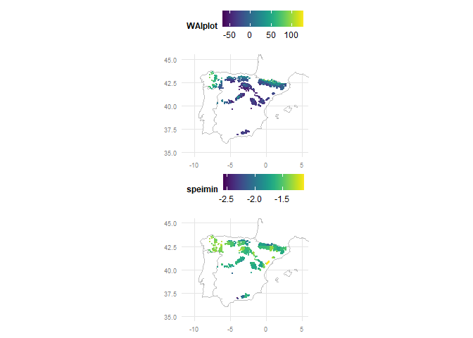
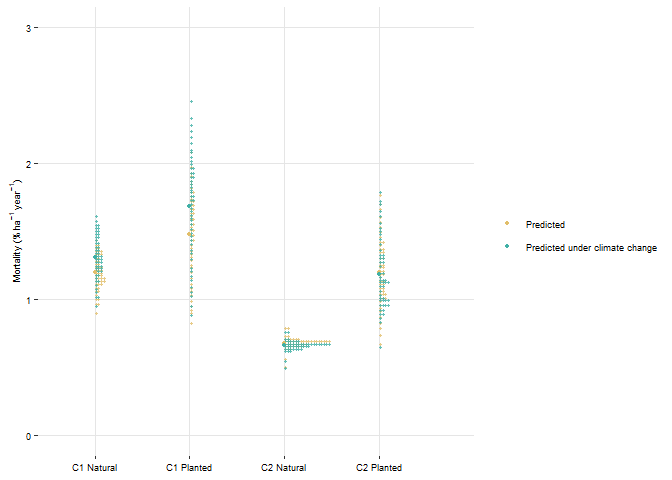
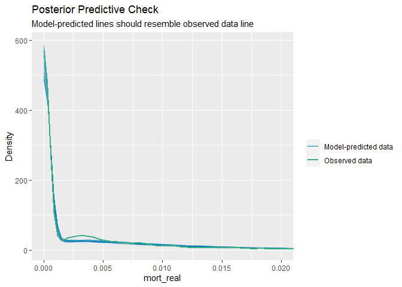
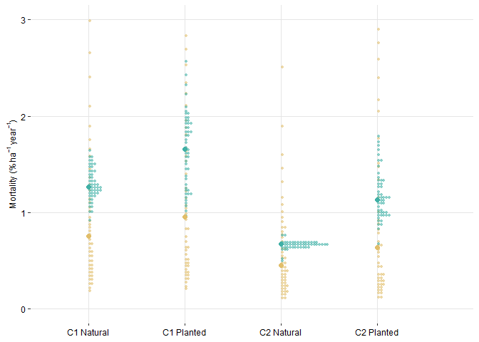

Modelling management legacies & climate change impacts on tree mortality
================

<style type="text/css">
pre {
  font-size: 10px
}
</style>

``` r
library(tidyverse)
library(here)
library(patchwork)
library(sf)
library(viridis)
library(glmmTMB)
library(DHARMa)
library(corrr)
library(bbmle)
library(MASS, exclude = "select")
library(performance)
library(ggdist)
library(RColorBrewer)
library(testthat)
```

``` r
dem_clim <- read_csv(
  here("01-data", "legacies", "dem_clim_ps_cut.csv")
)

table(dem_clim$k3)
```

    ## 
    ##    1    2 
    ## 3173 1638

``` r
table(dem_clim$type2.x)
```

    ## 
    ## Natural Planted 
    ##    3519    1292

``` r
summary(dem_clim$Mortality23)
```

    ##     Min.  1st Qu.   Median     Mean  3rd Qu.     Max. 
    ## 0.000000 0.000000 0.000000 0.002400 0.002289 0.090909

``` r
dem_clim <- dem_clim |> 
  unite("k_type", k3:type2.x) |> 
  mutate(
    mort_real = if_else(
      Cut32 == 0, Mortality_ausente23 + Mortality23, 
      Mortality23
    )
  )
 
table(dem_clim$k_type)
```

    ## 
    ## 1_Natural 1_Planted 2_Natural 2_Planted 
    ##      2401       772      1118       520

# Exploratory data analyses

``` r
glimpse(dem_clim)
```

    ## Rows: 4,811
    ## Columns: 20
    ## $ IDPC3               <chr> "100303A1", "10067A1", "100773A1", "100775A1", "10…
    ## $ CX                  <dbl> 262000, 490000, 263000, 263000, 262000, 258000, 49…
    ## $ CY                  <dbl> 4470000, 4774000, 4468000, 4467000, 4463000, 44590…
    ## $ k_type              <chr> "1_Planted", "1_Planted", "1_Planted", "1_Planted"…
    ## $ Cut32               <dbl> 0, 0, 0, 0, 1, 0, 0, 1, 0, 1, 0, 0, 0, 1, 1, 0, 0,…
    ## $ Ingrowth23          <dbl> 0.15401126, 0.00000000, 0.00368975, 0.00000000, 0.…
    ## $ Growth23            <dbl> 0.3532402214, 0.0218017605, 0.1356360226, 0.205318…
    ## $ Mortality23         <dbl> 0.000000000, 0.000000000, 0.008337227, 0.000000000…
    ## $ Mortality23_nd      <dbl> 0.00000000, 0.00000000, 0.12658182, 0.00000000, 0.…
    ## $ Mortality_ausente23 <dbl> 0.00000000, 0.00000000, 0.00000000, 0.00000000, 0.…
    ## $ BAc23               <dbl> 0.0201282372, 0.0023934322, 0.0093027502, -0.00958…
    ## $ ba_ifn2             <dbl> 1.381850, 4.409798, 15.182725, 4.547981, 26.897508…
    ## $ sf_nfi              <dbl> 14.5185200, 0.1111111, 14.3333300, 17.7407400, 15.…
    ## $ sgdd_nfi            <dbl> 2031.359, 3091.041, 2044.532, 1888.251, 1993.029, …
    ## $ PPplot              <dbl> 1050, 1028, 1041, 1112, 1067, 978, 1016, 1009, 100…
    ## $ PETplot             <dbl> 957, 798, 958, 937, 956, 994, 804, 807, 816, 814, …
    ## $ WAIplot             <dbl> 9.717868, 28.822055, 8.663883, 18.676628, 11.61087…
    ## $ speimean            <dbl> -0.05407972, -0.38432246, -0.05407972, -0.05407972…
    ## $ speimin             <dbl> -1.713884, -1.885054, -1.713884, -1.713884, -1.713…
    ## $ mort_real           <dbl> 0.000000000, 0.000000000, 0.008337227, 0.000000000…

``` r
summary(dem_clim$mort_real)
```

    ##     Min.  1st Qu.   Median     Mean  3rd Qu.     Max. 
    ## 0.000000 0.000000 0.000000 0.003459 0.003593 0.090909

``` r
summary(dem_clim$WAIplot)
```

    ##    Min. 1st Qu.  Median    Mean 3rd Qu.    Max. 
    ## -67.186 -29.780 -11.345  -6.280   9.726 127.395

``` r
summary(dem_clim$speimin)
```

    ##    Min. 1st Qu.  Median    Mean 3rd Qu.    Max. 
    ##  -2.565  -1.692  -1.623  -1.619  -1.582  -1.123

``` r
ggplot(dem_clim) +
  geom_histogram(aes(mort_real), bins = 50)
```

<!-- -->

``` r
map_loc <- map_data("world", region = c("Portugal", "Spain", "France",
                                        "Andorra")) |> 
  ggplot(aes(x = long, y = lat)) + 
  geom_polygon(aes(group = group), 
               fill = "white", 
               color = "grey") +
  coord_fixed(xlim = c(-11, 5),  
              ylim = c(35, 45), 
              ratio = 1.3) +
  xlab("Longitude") +
  ylab("Latitude") + 
  theme(legend.title = element_text(colour = "black", face = "bold", size = 12),
        legend.position = c(0.9, 0.2),
        legend.text = element_text(size = 11),
        axis.title.x = element_blank(),
        axis.title.y = element_blank(),  
        axis.text.x = element_text(colour = "grey50", size = 8),
        axis.text.y = element_text(colour = "grey50", size = 8),
        axis.ticks = element_blank(),
        panel.grid.major = element_line(colour = "grey90", size = 0.5), 
        axis.line = element_blank(),
        panel.background = element_blank()) 

# set as sf and assign crs
dem_clim_sf <- st_as_sf(x = dem_clim, 
                        coords = c("CX", "CY"),
                        crs = "+proj=utm +zone=30 +ellps=intl +units=m +no_defs")
st_crs(dem_clim_sf)
```

    ## Coordinate Reference System:
    ##   User input: +proj=utm +zone=30 +ellps=intl +units=m +no_defs 
    ##   wkt:
    ## PROJCRS["unknown",
    ##     BASEGEOGCRS["unknown",
    ##         DATUM["Unknown based on International 1909 (Hayford) ellipsoid",
    ##             ELLIPSOID["International 1909 (Hayford)",6378388,297,
    ##                 LENGTHUNIT["metre",1,
    ##                     ID["EPSG",9001]]]],
    ##         PRIMEM["Greenwich",0,
    ##             ANGLEUNIT["degree",0.0174532925199433],
    ##             ID["EPSG",8901]]],
    ##     CONVERSION["UTM zone 30N",
    ##         METHOD["Transverse Mercator",
    ##             ID["EPSG",9807]],
    ##         PARAMETER["Latitude of natural origin",0,
    ##             ANGLEUNIT["degree",0.0174532925199433],
    ##             ID["EPSG",8801]],
    ##         PARAMETER["Longitude of natural origin",-3,
    ##             ANGLEUNIT["degree",0.0174532925199433],
    ##             ID["EPSG",8802]],
    ##         PARAMETER["Scale factor at natural origin",0.9996,
    ##             SCALEUNIT["unity",1],
    ##             ID["EPSG",8805]],
    ##         PARAMETER["False easting",500000,
    ##             LENGTHUNIT["metre",1],
    ##             ID["EPSG",8806]],
    ##         PARAMETER["False northing",0,
    ##             LENGTHUNIT["metre",1],
    ##             ID["EPSG",8807]],
    ##         ID["EPSG",16030]],
    ##     CS[Cartesian,2],
    ##         AXIS["(E)",east,
    ##             ORDER[1],
    ##             LENGTHUNIT["metre",1,
    ##                 ID["EPSG",9001]]],
    ##         AXIS["(N)",north,
    ##             ORDER[2],
    ##             LENGTHUNIT["metre",1,
    ##                 ID["EPSG",9001]]]]

``` r
ggplot() + 
  geom_sf(data = dem_clim_sf)
```

<!-- -->

``` r
# transform to long lat
dem_clim_sf_map <- st_transform(
  dem_clim_sf,
  "+proj=longlat +ellps=WGS84 +datum=WGS84 +no_defs"
)

st_crs(dem_clim_sf_map)
```

    ## Coordinate Reference System:
    ##   User input: +proj=longlat +ellps=WGS84 +datum=WGS84 +no_defs 
    ##   wkt:
    ## GEOGCRS["unknown",
    ##     DATUM["World Geodetic System 1984",
    ##         ELLIPSOID["WGS 84",6378137,298.257223563,
    ##             LENGTHUNIT["metre",1]],
    ##         ID["EPSG",6326]],
    ##     PRIMEM["Greenwich",0,
    ##         ANGLEUNIT["degree",0.0174532925199433],
    ##         ID["EPSG",8901]],
    ##     CS[ellipsoidal,2],
    ##         AXIS["longitude",east,
    ##             ORDER[1],
    ##             ANGLEUNIT["degree",0.0174532925199433,
    ##                 ID["EPSG",9122]]],
    ##         AXIS["latitude",north,
    ##             ORDER[2],
    ##             ANGLEUNIT["degree",0.0174532925199433,
    ##                 ID["EPSG",9122]]]]

``` r
# convert to tibble
dem_clim_sp_tb <- dem_clim_sf_map |>
  ungroup() |> 
  mutate(CX = unlist(map(dem_clim_sf_map$geometry, 1)),
         CY = unlist(map(dem_clim_sf_map$geometry, 2))) |> 
  as_tibble() |> 
  dplyr::select(!geometry)

map_plot <- function(col){
  map_loc + 
    geom_point(data = dem_clim_sp_tb,
               aes(CX, CY, color = .data[[col]]), size = .5, alpha = .8) + 
    scale_color_viridis() +
    xlab("") +
    ylab("") + 
    theme(plot.margin = margin(0, 0, 0, 0),
          legend.title = element_text(color = "black", size = 9),
          legend.text = element_text(size = 9),
          legend.key = element_blank(),
          legend.position = "top",
          legend.justification = "left",
          legend.background = element_rect(fill = "white", colour = NA),
          axis.title = element_blank(),
          axis.text.x = element_text(colour = "grey50", size = 7),
          axis.text.y = element_text(colour = "grey50", size = 7),
          panel.grid.major = element_line(colour = "grey90", size = 0.5), 
          axis.line = element_blank(),
          panel.background = element_blank())
}

map_plot("WAIplot") + map_plot("speimin")
```

<!-- -->

``` r
# full data
gg_mort <- function(x){
  dem_clim |> 
    ggplot(aes(x = .data[[x]], y = Mortality23)) + 
    geom_hex() + 
    ggtitle("Full data = ")
}

var_int_all <- c(
  "WAIplot", "speimin", "k_type"
)

map(var_int_all, ~gg_mort(.)) |> 
  reduce(`/`)
```

<!-- -->

``` r
ggsave(
  here("03-results", "others", "distri_explanatory.png"),
  width = 12, height = 4
)

# n. of plots
nrow(dem_clim)
```

    ## [1] 4811

``` r
# n. of plots with any dead trees
sum(dem_clim$Mortality23 > 0)
```

    ## [1] 1383

``` r
## correlations ------------------------------------------------------------
corm <- dem_clim |>
  dplyr::select(
    WAIplot, speimin
  ) |>
  corrr::correlate(diagonal = 1) |>
  corrr::shave(upper = FALSE) |>
  pivot_longer(
    cols = -term,
    names_to = "colname",
    values_to = "corr"
  ) |>
  mutate(term = fct_inorder(term),
         colname = fct_inorder(colname))

gg_cor <- ggplot(corm, aes(term, fct_rev(colname),
                 fill = corr)) +
  geom_tile() +
  geom_text(aes(
    label = format(round(corr, 2), nsmall = 2),
    color = abs(corr) < .60)) +
  coord_fixed(expand = FALSE) +
  scale_color_manual(values = c("white", "black"),
                     guide = "none") +
  scale_fill_distiller(
    palette = "PuOr", na.value = "white",
    direction = 1, limits = c(-1, 1)) +
  labs(x = NULL, y = NULL) +
  theme(panel.border = element_rect(color = NA, fill = NA),
        legend.position = c(.85, .8))

gg_cor
```

<!-- -->

``` r
ggsave(
  plot = gg_cor,
  here("03-results", "si_figures", "s4_correlations.png"),
  width = 3.5, height = 5,
  dpi = 600
)
```

# Modelling

``` r
# https://stackoverflow.com/questions/65745148/is-there-a-difference-between-gamma-hurdle-two-part-models-and-zero-inflated-g

zigamma_model_1 <- glmmTMB(
  mort_real ~ k_type * WAIplot * speimin,
  family = ziGamma(link = "log"),
  # we assume that absences will at least vary by:
  ziformula = ~ k_type * WAIplot * speimin,
  data = dem_clim
  )

# model output interpretation:
# https://journal.r-project.org/archive/2017/RJ-2017-066/RJ-2017-066.pdf
# https://cran.r-project.org/web/packages/glmmTMB/glmmTMB.pdf
# https://cran.r-project.org/web/packages/glmmTMB/vignettes/glmmTMB.pdf
summary(zigamma_model_1)
```

    ##  Family: Gamma  ( log )
    ## Formula:          mort_real ~ k_type * WAIplot * speimin
    ## Zero inflation:             ~k_type * WAIplot * speimin
    ## Data: dem_clim
    ## 
    ##      AIC      BIC   logLik deviance df.resid 
    ##  -6208.9  -5995.1   3137.5  -6274.9     4778 
    ## 
    ## 
    ## Dispersion estimate for Gamma family (sigma^2): 0.68 
    ## 
    ## Conditional model:
    ##                                   Estimate Std. Error z value Pr(>|z|)    
    ## (Intercept)                     -5.110e+00  3.714e-01 -13.757  < 2e-16 ***
    ## k_type1_Planted                  1.171e+00  7.681e-01   1.524  0.12754    
    ## k_type2_Natural                  1.051e+00  6.187e-01   1.699  0.08932 .  
    ## k_type2_Planted                  1.719e+00  6.641e-01   2.588  0.00965 ** 
    ## WAIplot                          6.748e-03  1.031e-02   0.655  0.51275    
    ## speimin                         -4.107e-01  2.256e-01  -1.820  0.06875 .  
    ## k_type1_Planted:WAIplot         -2.043e-05  2.445e-02  -0.001  0.99933    
    ## k_type2_Natural:WAIplot         -3.427e-03  1.659e-02  -0.207  0.83632    
    ## k_type2_Planted:WAIplot         -4.456e-02  2.233e-02  -1.996  0.04594 *  
    ## k_type1_Planted:speimin          6.550e-01  4.856e-01   1.349  0.17734    
    ## k_type2_Natural:speimin          9.812e-01  3.758e-01   2.611  0.00902 ** 
    ## k_type2_Planted:speimin          1.113e+00  4.200e-01   2.650  0.00805 ** 
    ## WAIplot:speimin                  6.079e-03  6.163e-03   0.986  0.32397    
    ## k_type1_Planted:WAIplot:speimin  3.237e-03  1.581e-02   0.205  0.83779    
    ## k_type2_Natural:WAIplot:speimin -3.705e-03  9.853e-03  -0.376  0.70692    
    ## k_type2_Planted:WAIplot:speimin -2.725e-02  1.443e-02  -1.889  0.05893 .  
    ## ---
    ## Signif. codes:  0 '***' 0.001 '**' 0.01 '*' 0.05 '.' 0.1 ' ' 1
    ## 
    ## Zero-inflation model:
    ##                                  Estimate Std. Error z value Pr(>|z|)   
    ## (Intercept)                      1.239139   0.636473   1.947  0.05155 . 
    ## k_type1_Planted                 -1.112860   1.078765  -1.032  0.30226   
    ## k_type2_Natural                 -3.108057   1.160303  -2.679  0.00739 **
    ## k_type2_Planted                 -0.085724   1.112357  -0.077  0.93857   
    ## WAIplot                         -0.016889   0.017210  -0.981  0.32641   
    ## speimin                          0.152914   0.387175   0.395  0.69288   
    ## k_type1_Planted:WAIplot          0.088537   0.032187   2.751  0.00595 **
    ## k_type2_Natural:WAIplot          0.062538   0.033318   1.877  0.06052 . 
    ## k_type2_Planted:WAIplot          0.014420   0.034406   0.419  0.67513   
    ## k_type1_Planted:speimin         -0.912515   0.677803  -1.346  0.17821   
    ## k_type2_Natural:speimin         -1.182461   0.703455  -1.681  0.09278 . 
    ## k_type2_Planted:speimin          0.548035   0.706782   0.775  0.43811   
    ## WAIplot:speimin                 -0.004183   0.010270  -0.407  0.68378   
    ## k_type1_Planted:WAIplot:speimin  0.054493   0.020585   2.647  0.00812 **
    ## k_type2_Natural:WAIplot:speimin  0.036733   0.019966   1.840  0.06580 . 
    ## k_type2_Planted:WAIplot:speimin  0.006597   0.022230   0.297  0.76666   
    ## ---
    ## Signif. codes:  0 '***' 0.001 '**' 0.01 '*' 0.05 '.' 0.1 ' ' 1

``` r
# This summary can be broken down into 3 sections.

# The top section is a general overview
# containing a description of the model specification
# (Family, Formula, Zero inflation, Dispersion
# Data) and resulting information criteria

# The second section describes the coefficients 
# of the Conditional model
# including Wald Z statistics and p-values. 
# Apart from the intercept, the estimates are all
# contrasts as is standard in regression models.
# This model has a log link as stated in the 
# top line of the summary

# The third section describes the Zero-inflation model 
# similarly to the Conditional model except that
# this model has a logit link. The zero-inflation model 
# estimates the probability of an extra zero such that
# a positive contrast indicates a higher chance of
# absence; this is the opposite of
# the conditional model where a positive contrast 
# indicates a higher abundance

zigamma_model_2 <- glmmTMB(
  mort_real ~ k_type * WAIplot + k_type * speimin,
  family = ziGamma(link = "log"),
  # we assume that absences will at least vary by:
  ziformula = ~ k_type * WAIplot * speimin,
  data = dem_clim
)

summary(zigamma_model_2)
```

    ##  Family: Gamma  ( log )
    ## Formula:          mort_real ~ k_type * WAIplot + k_type * speimin
    ## Zero inflation:             ~k_type * WAIplot * speimin
    ## Data: dem_clim
    ## 
    ##      AIC      BIC   logLik deviance df.resid 
    ##  -6212.9  -6025.0   3135.4  -6270.9     4782 
    ## 
    ## 
    ## Dispersion estimate for Gamma family (sigma^2): 0.682 
    ## 
    ## Conditional model:
    ##                           Estimate Std. Error z value Pr(>|z|)    
    ## (Intercept)             -5.1265582  0.3753642 -13.658  < 2e-16 ***
    ## k_type1_Planted          1.2834568  0.7611187   1.686 0.091742 .  
    ## k_type2_Natural          1.0899380  0.6192437   1.760 0.078389 .  
    ## k_type2_Planted          1.7109441  0.6651767   2.572 0.010106 *  
    ## WAIplot                 -0.0033511  0.0009988  -3.355 0.000793 ***
    ## speimin                 -0.4191160  0.2280526  -1.838 0.066091 .  
    ## k_type1_Planted:WAIplot -0.0040327  0.0024325  -1.658 0.097344 .  
    ## k_type2_Natural:WAIplot  0.0026829  0.0016095   1.667 0.095546 .  
    ## k_type2_Planted:WAIplot -0.0024204  0.0022403  -1.080 0.279970    
    ## k_type1_Planted:speimin  0.7235635  0.4814481   1.503 0.132867    
    ## k_type2_Natural:speimin  1.0046176  0.3754290   2.676 0.007452 ** 
    ## k_type2_Planted:speimin  1.1205896  0.4196260   2.670 0.007575 ** 
    ## ---
    ## Signif. codes:  0 '***' 0.001 '**' 0.01 '*' 0.05 '.' 0.1 ' ' 1
    ## 
    ## Zero-inflation model:
    ##                                  Estimate Std. Error z value Pr(>|z|)   
    ## (Intercept)                      1.239110   0.636473   1.947  0.05155 . 
    ## k_type1_Planted                 -1.112879   1.078764  -1.032  0.30225   
    ## k_type2_Natural                 -3.108063   1.160302  -2.679  0.00739 **
    ## k_type2_Planted                 -0.085756   1.112356  -0.077  0.93855   
    ## WAIplot                         -0.016887   0.017210  -0.981  0.32648   
    ## speimin                          0.152894   0.387175   0.395  0.69292   
    ## k_type1_Planted:WAIplot          0.088535   0.032187   2.751  0.00595 **
    ## k_type2_Natural:WAIplot          0.062533   0.033318   1.877  0.06054 . 
    ## k_type2_Planted:WAIplot          0.014414   0.034406   0.419  0.67526   
    ## k_type1_Planted:speimin         -0.912523   0.677802  -1.346  0.17821   
    ## k_type2_Natural:speimin         -1.182461   0.703454  -1.681  0.09278 . 
    ## k_type2_Planted:speimin          0.548014   0.706782   0.775  0.43812   
    ## WAIplot:speimin                 -0.004181   0.010270  -0.407  0.68389   
    ## k_type1_Planted:WAIplot:speimin  0.054491   0.020585   2.647  0.00812 **
    ## k_type2_Natural:WAIplot:speimin  0.036730   0.019966   1.840  0.06582 . 
    ## k_type2_Planted:WAIplot:speimin  0.006593   0.022230   0.297  0.76679   
    ## ---
    ## Signif. codes:  0 '***' 0.001 '**' 0.01 '*' 0.05 '.' 0.1 ' ' 1

``` r
zigamma_model_3 <- glmmTMB(
  mort_real ~ WAIplot + k_type * speimin,
  family = ziGamma(link = "log"),
  # we assume that absences will at least vary by:
  ziformula = ~ k_type * WAIplot * speimin,
  data = dem_clim
)

summary(zigamma_model_3)
```

    ##  Family: Gamma  ( log )
    ## Formula:          mort_real ~ WAIplot + k_type * speimin
    ## Zero inflation:             ~k_type * WAIplot * speimin
    ## Data: dem_clim
    ## 
    ##      AIC      BIC   logLik deviance df.resid 
    ##  -6209.7  -6041.3   3130.9  -6261.7     4785 
    ## 
    ## 
    ## Dispersion estimate for Gamma family (sigma^2): 0.685 
    ## 
    ## Conditional model:
    ##                           Estimate Std. Error z value Pr(>|z|)    
    ## (Intercept)             -5.1204487  0.3750712 -13.652  < 2e-16 ***
    ## WAIplot                 -0.0031858  0.0006953  -4.582 4.61e-06 ***
    ## k_type1_Planted          1.2940595  0.7774866   1.664   0.0960 .  
    ## k_type2_Natural          0.7935201  0.6013685   1.320   0.1870    
    ## k_type2_Planted          1.6276257  0.6713484   2.424   0.0153 *  
    ## speimin                 -0.4150045  0.2277342  -1.822   0.0684 .  
    ## k_type1_Planted:speimin  0.7089577  0.4920948   1.441   0.1497    
    ## k_type2_Natural:speimin  0.8308952  0.3650464   2.276   0.0228 *  
    ## k_type2_Planted:speimin  1.0523835  0.4228029   2.489   0.0128 *  
    ## ---
    ## Signif. codes:  0 '***' 0.001 '**' 0.01 '*' 0.05 '.' 0.1 ' ' 1
    ## 
    ## Zero-inflation model:
    ##                                  Estimate Std. Error z value Pr(>|z|)   
    ## (Intercept)                      1.239133   0.636474   1.947  0.05155 . 
    ## k_type1_Planted                 -1.112844   1.078764  -1.032  0.30226   
    ## k_type2_Natural                 -3.108050   1.160302  -2.679  0.00739 **
    ## k_type2_Planted                 -0.085702   1.112357  -0.077  0.93859   
    ## WAIplot                         -0.016889   0.017210  -0.981  0.32643   
    ## speimin                          0.152908   0.387176   0.395  0.69289   
    ## k_type1_Planted:WAIplot          0.088536   0.032187   2.751  0.00595 **
    ## k_type2_Natural:WAIplot          0.062536   0.033318   1.877  0.06053 . 
    ## k_type2_Planted:WAIplot          0.014420   0.034406   0.419  0.67514   
    ## k_type1_Planted:speimin         -0.912499   0.677802  -1.346  0.17822   
    ## k_type2_Natural:speimin         -1.182456   0.703454  -1.681  0.09278 . 
    ## k_type2_Planted:speimin          0.548049   0.706782   0.775  0.43809   
    ## WAIplot:speimin                 -0.004183   0.010270  -0.407  0.68381   
    ## k_type1_Planted:WAIplot:speimin  0.054492   0.020585   2.647  0.00812 **
    ## k_type2_Natural:WAIplot:speimin  0.036732   0.019966   1.840  0.06580 . 
    ## k_type2_Planted:WAIplot:speimin  0.006596   0.022230   0.297  0.76667   
    ## ---
    ## Signif. codes:  0 '***' 0.001 '**' 0.01 '*' 0.05 '.' 0.1 ' ' 1

``` r
zigamma_model_4 <- glmmTMB(
  mort_real ~ speimin + k_type * WAIplot,
  family = ziGamma(link = "log"),
  # we assume that absences will at least vary by:
  ziformula = ~ k_type * WAIplot * speimin,
  data = dem_clim
)

summary(zigamma_model_4)
```

    ##  Family: Gamma  ( log )
    ## Formula:          mort_real ~ speimin + k_type * WAIplot
    ## Zero inflation:             ~k_type * WAIplot * speimin
    ## Data: dem_clim
    ## 
    ##      AIC      BIC   logLik deviance df.resid 
    ##  -6208.0  -6039.5   3130.0  -6260.0     4785 
    ## 
    ## 
    ## Dispersion estimate for Gamma family (sigma^2): 0.685 
    ## 
    ## Conditional model:
    ##                           Estimate Std. Error z value Pr(>|z|)    
    ## (Intercept)             -4.2367539  0.2509714 -16.881  < 2e-16 ***
    ## speimin                  0.1216737  0.1506904   0.807  0.41941    
    ## k_type1_Planted          0.1102001  0.0773022   1.426  0.15399    
    ## k_type2_Natural         -0.5624914  0.0477827 -11.772  < 2e-16 ***
    ## k_type2_Planted         -0.0741467  0.0665860  -1.114  0.26547    
    ## WAIplot                 -0.0031066  0.0009967  -3.117  0.00183 ** 
    ## k_type1_Planted:WAIplot -0.0042460  0.0024304  -1.747  0.08063 .  
    ## k_type2_Natural:WAIplot  0.0019105  0.0015795   1.210  0.22646    
    ## k_type2_Planted:WAIplot -0.0021346  0.0022183  -0.962  0.33592    
    ## ---
    ## Signif. codes:  0 '***' 0.001 '**' 0.01 '*' 0.05 '.' 0.1 ' ' 1
    ## 
    ## Zero-inflation model:
    ##                                  Estimate Std. Error z value Pr(>|z|)   
    ## (Intercept)                      1.239119   0.636473   1.947  0.05155 . 
    ## k_type1_Planted                 -1.112845   1.078765  -1.032  0.30226   
    ## k_type2_Natural                 -3.108022   1.160301  -2.679  0.00739 **
    ## k_type2_Planted                 -0.085726   1.112356  -0.077  0.93857   
    ## WAIplot                         -0.016889   0.017210  -0.981  0.32640   
    ## speimin                          0.152905   0.387175   0.395  0.69290   
    ## k_type1_Planted:WAIplot          0.088535   0.032187   2.751  0.00595 **
    ## k_type2_Natural:WAIplot          0.062536   0.033318   1.877  0.06053 . 
    ## k_type2_Planted:WAIplot          0.014419   0.034406   0.419  0.67516   
    ## k_type1_Planted:speimin         -0.912510   0.677803  -1.346  0.17821   
    ## k_type2_Natural:speimin         -1.182443   0.703454  -1.681  0.09278 . 
    ## k_type2_Planted:speimin          0.548035   0.706782   0.775  0.43811   
    ## WAIplot:speimin                 -0.004183   0.010270  -0.407  0.68378   
    ## k_type1_Planted:WAIplot:speimin  0.054491   0.020585   2.647  0.00812 **
    ## k_type2_Natural:WAIplot:speimin  0.036732   0.019966   1.840  0.06580 . 
    ## k_type2_Planted:WAIplot:speimin  0.006595   0.022230   0.297  0.76670   
    ## ---
    ## Signif. codes:  0 '***' 0.001 '**' 0.01 '*' 0.05 '.' 0.1 ' ' 1

``` r
bbmle::AICtab(
  zigamma_model_1,
  zigamma_model_2,
  zigamma_model_3,
  zigamma_model_4
  )
```

    ##                 dAIC df
    ## zigamma_model_2  0.0 29
    ## zigamma_model_3  3.2 26
    ## zigamma_model_1  4.0 33
    ## zigamma_model_4  4.9 26

``` r
# https://cran.r-project.org/web/packages/glmmTMB/vignettes/model_evaluation.pdf

## model checking and diagnostics ------------------------------------------
# https://cran.r-project.org/web/packages/DHARMa/vignettes/DHARMa.html
zigamma_model_simres_1 <- simulateResiduals(zigamma_model_1)
x11()
# par(mfrow = c(2, 2))
plot(zigamma_model_simres_1)
```

<!-- -->

``` r
# plotResiduals(zigamma_model_simres_1)
# plotQQunif(zigamma_model_simres_1)
# testZeroInflation(zigamma_model_simres_1)

x11()
testDispersion(zigamma_model_simres_1)
```

<!-- -->

    ## 
    ##  DHARMa nonparametric dispersion test via sd of residuals fitted vs.
    ##  simulated
    ## 
    ## data:  simulationOutput
    ## dispersion = 1.2917, p-value < 2.2e-16
    ## alternative hypothesis: two.sided

``` r
# shows your actual dispersion
# with a histogram of simulated residuals. 
# Since your value is to the right it indicates
# that your model has over-dispersion
plot(check_predictions(zigamma_model_1)) +
  coord_cartesian(xlim = c(0, 0.02))
```

<!-- -->

``` r
testZeroInflation(zigamma_model_simres_1)
```

<!-- -->

    ## 
    ##  DHARMa zero-inflation test via comparison to expected zeros with
    ##  simulation under H0 = fitted model
    ## 
    ## data:  simulationOutput
    ## ratioObsSim = 0.99946, p-value = 0.992
    ## alternative hypothesis: two.sided

``` r
# shows the simulated number
# of zeroes with your actual number shown as red. 
# we have the same number as expected
# so there is no zero-inflation now
# makes sense to fit a zero-inflated model

# sensitivity analysis
# predict_real <- predict(
#   object = zigamma_model_1, newdata = dem_clim,
#   se.fit = TRUE, type = "conditional"
# )
# 
# dem_clim_pred <- dem_clim |>
#   mutate(
#     predFE = predict_real$fit
#   )
# 
# dem_clim_pred_n0 <- dem_clim_pred |>
#   filter(mort_real > 0)
# 
# ggplot(dem_clim_pred_n0, aes(
#   mort_real, predFE
#   )) +
#   geom_point(alpha = .7) +
#   geom_abline(intercept = 0, slope = 1, color = "red") +
#   coord_cartesian(xlim = c(0, .08), ylim = c(0, .08))

## predictions -------------------------------------------
summary(zigamma_model_1)
```

    ##  Family: Gamma  ( log )
    ## Formula:          mort_real ~ k_type * WAIplot * speimin
    ## Zero inflation:             ~k_type * WAIplot * speimin
    ## Data: dem_clim
    ## 
    ##      AIC      BIC   logLik deviance df.resid 
    ##  -6208.9  -5995.1   3137.5  -6274.9     4778 
    ## 
    ## 
    ## Dispersion estimate for Gamma family (sigma^2): 0.68 
    ## 
    ## Conditional model:
    ##                                   Estimate Std. Error z value Pr(>|z|)    
    ## (Intercept)                     -5.110e+00  3.714e-01 -13.757  < 2e-16 ***
    ## k_type1_Planted                  1.171e+00  7.681e-01   1.524  0.12754    
    ## k_type2_Natural                  1.051e+00  6.187e-01   1.699  0.08932 .  
    ## k_type2_Planted                  1.719e+00  6.641e-01   2.588  0.00965 ** 
    ## WAIplot                          6.748e-03  1.031e-02   0.655  0.51275    
    ## speimin                         -4.107e-01  2.256e-01  -1.820  0.06875 .  
    ## k_type1_Planted:WAIplot         -2.043e-05  2.445e-02  -0.001  0.99933    
    ## k_type2_Natural:WAIplot         -3.427e-03  1.659e-02  -0.207  0.83632    
    ## k_type2_Planted:WAIplot         -4.456e-02  2.233e-02  -1.996  0.04594 *  
    ## k_type1_Planted:speimin          6.550e-01  4.856e-01   1.349  0.17734    
    ## k_type2_Natural:speimin          9.812e-01  3.758e-01   2.611  0.00902 ** 
    ## k_type2_Planted:speimin          1.113e+00  4.200e-01   2.650  0.00805 ** 
    ## WAIplot:speimin                  6.079e-03  6.163e-03   0.986  0.32397    
    ## k_type1_Planted:WAIplot:speimin  3.237e-03  1.581e-02   0.205  0.83779    
    ## k_type2_Natural:WAIplot:speimin -3.705e-03  9.853e-03  -0.376  0.70692    
    ## k_type2_Planted:WAIplot:speimin -2.725e-02  1.443e-02  -1.889  0.05893 .  
    ## ---
    ## Signif. codes:  0 '***' 0.001 '**' 0.01 '*' 0.05 '.' 0.1 ' ' 1
    ## 
    ## Zero-inflation model:
    ##                                  Estimate Std. Error z value Pr(>|z|)   
    ## (Intercept)                      1.239139   0.636473   1.947  0.05155 . 
    ## k_type1_Planted                 -1.112860   1.078765  -1.032  0.30226   
    ## k_type2_Natural                 -3.108057   1.160303  -2.679  0.00739 **
    ## k_type2_Planted                 -0.085724   1.112357  -0.077  0.93857   
    ## WAIplot                         -0.016889   0.017210  -0.981  0.32641   
    ## speimin                          0.152914   0.387175   0.395  0.69288   
    ## k_type1_Planted:WAIplot          0.088537   0.032187   2.751  0.00595 **
    ## k_type2_Natural:WAIplot          0.062538   0.033318   1.877  0.06052 . 
    ## k_type2_Planted:WAIplot          0.014420   0.034406   0.419  0.67513   
    ## k_type1_Planted:speimin         -0.912515   0.677803  -1.346  0.17821   
    ## k_type2_Natural:speimin         -1.182461   0.703455  -1.681  0.09278 . 
    ## k_type2_Planted:speimin          0.548035   0.706782   0.775  0.43811   
    ## WAIplot:speimin                 -0.004183   0.010270  -0.407  0.68378   
    ## k_type1_Planted:WAIplot:speimin  0.054493   0.020585   2.647  0.00812 **
    ## k_type2_Natural:WAIplot:speimin  0.036733   0.019966   1.840  0.06580 . 
    ## k_type2_Planted:WAIplot:speimin  0.006597   0.022230   0.297  0.76666   
    ## ---
    ## Signif. codes:  0 '***' 0.001 '**' 0.01 '*' 0.05 '.' 0.1 ' ' 1

``` r
# zigamma_model_1 <- zigamma_model_1 

# newdata
# change climate
# reduction in WAI & spei per plot equal to 
# the difference between the median & the 1st Qu
summary(dem_clim$WAIplot)
```

    ##    Min. 1st Qu.  Median    Mean 3rd Qu.    Max. 
    ## -67.186 -29.780 -11.345  -6.280   9.726 127.395

``` r
summary(dem_clim$speimin)
```

    ##    Min. 1st Qu.  Median    Mean 3rd Qu.    Max. 
    ##  -2.565  -1.692  -1.623  -1.619  -1.582  -1.123

``` r
dem_clim_cc <- dem_clim |> 
  mutate(
    WAIplot = WAIplot - 18.435,
    speimin = speimin - 0.069
  )

# change legacy for planted plots + climate impact
dem_clim_c2p_cc <- dem_clim |> 
    filter(
    k_type == "1_Planted" |
      k_type == "2_Planted"
    ) |> 
  mutate(
    k_type = "2_Planted",
    WAIplot = WAIplot - 18.435,
    speimin = speimin - 0.069
  )

dem_clim_c2n_cc <- dem_clim |> 
    filter(
    k_type == "1_Natural" |
      k_type == "2_Natural"
    ) |> 
  mutate(
    k_type = "2_Natural",
    WAIplot = WAIplot - 18.435,
    speimin = speimin - 0.069
  )

dem_clim_new <- list(
  dem_clim_cc,
  dem_clim_c2p_cc,
  dem_clim_c2n_cc
)

# https://www.rdocumentation.org/packages/glmmTMB/versions/1.1.3/topics/predict.glmmTMB
dem_clim_pred <- map(dem_clim_new, ~predict(
  object = zigamma_model_1, newdata = .x,
  se.fit = TRUE, type = "conditional"
))

# add predictions to the corresponding dataset
add_predictions <- function(dat, pred){
  dat |> 
    mutate(
      predFE = pred$fit
    )
}

arg2_dat_pred <- list(
  dat = dem_clim_new, 
  pred = dem_clim_pred
  )

dem_clim_new_pred <- arg2_dat_pred |>
  pmap(add_predictions)

# add observed data
## all plots
dem_clim_obs_all <- dem_clim

## only planted plots
dem_clim_obs_p <- dem_clim |> 
  filter(
    k_type == "1_Planted" |
      k_type == "2_Planted"
    ) 

## only natural plots
dem_clim_obs_n <- dem_clim |> 
  filter(
    k_type == "1_Natural" |
      k_type == "2_Natural"
    ) 

dem_clim_pred_obs <- append(
  dem_clim_new_pred, 
  c(list(dem_clim_obs_all),
  list(dem_clim_obs_p),
  list(dem_clim_obs_n))
  )
length(dem_clim_pred_obs)
```

    ## [1] 6

``` r
names(dem_clim_pred_obs) <- c(
  "dem_clim_cc",
  "dem_clim_c2p_cc",
  "dem_clim_c2n_cc",
  "dem_clim_obs_all",
  "dem_clim_obs_p",
  "dem_clim_obs_n"
)

# add prediction name to each dataset
mutate_name <- function(x, names_df){
  dem_clim_pred_obs[[x]] |> 
    dplyr::mutate(
      df = names_df
    )
}

arg2_x_names_df <- list(
  x = 1:length(dem_clim_pred_obs), 
  names_df = names(dem_clim_pred_obs)
  )

dem_clim_pred_obs_n <- arg2_x_names_df |>
  pmap_df(mutate_name)

table(dem_clim_pred_obs_n$df)
```

    ## 
    ##  dem_clim_c2n_cc  dem_clim_c2p_cc      dem_clim_cc dem_clim_obs_all 
    ##             3519             1292             4811             4811 
    ##   dem_clim_obs_n   dem_clim_obs_p 
    ##             3519             1292

``` r
dem_clim_all_pred_obs <- dem_clim_pred_obs_n |> 
  filter(df == "dem_clim_cc" |
           df == "dem_clim_obs_all")

table(dem_clim_all_pred_obs$k_type)
```

    ## 
    ## 1_Natural 1_Planted 2_Natural 2_Planted 
    ##      4802      1544      2236      1040

``` r
table(dem_clim_all_pred_obs$df)
```

    ## 
    ##      dem_clim_cc dem_clim_obs_all 
    ##             4811             4811

``` r
dem_clim_all_pred_obs <- dem_clim_all_pred_obs |> 
  mutate(
    mortality_pred_obs = if_else(
      is.na(predFE), mort_real, predFE
    )
  )

summary(dem_clim_all_pred_obs$mort_real)
```

    ##     Min.  1st Qu.   Median     Mean  3rd Qu.     Max. 
    ## 0.000000 0.000000 0.000000 0.003459 0.003595 0.090909

``` r
summary(dem_clim_all_pred_obs$predFE)
```

    ##    Min. 1st Qu.  Median    Mean 3rd Qu.    Max.    NA's 
    ##   0.004   0.009   0.013   0.012   0.015   0.031    4811

``` r
# https://cran.r-project.org/web/packages/ggdist/vignettes/slabinterval.html#multiple-slabs-and-intervals-in-composite-plots
# Quantile dotplots
gg_dem_clim_all_pred_obs <- dem_clim_all_pred_obs |>
  # when there is mortality (conditional part)
  filter(mort_real > 0) |> 
  mutate(
    k_type = recode_factor(
      k_type, 
      "1_Natural" = "C1 Natural",
      "1_Planted" = "C1 Planted",
      "2_Natural" = "C2 Natural",
      "2_Planted" = "C2 Planted"
    ),
    df = recode_factor(
      df, 
      "dem_clim_obs_all" = "Observed",
      "dem_clim_cc" = "Predicted"
    )
  ) |>
  ggplot(aes(x = k_type, y = mortality_pred_obs * 100,
             color = df, fill = df
             )) +
  stat_dots(
    scale = 0.5,
    quantiles = 50,
    .width = 0,
    alpha = .5,
    color = NA,
    size = 0
    ) +
    stat_halfeye(
    .width = 0,
    slab_fill = NA,
  ) +
  ylab(expression(paste("Mortality (%",~ha^-1~year^-1,")"))) +
  scale_fill_manual(values = c("#E1BE6A", "#40B0A6"),
                    guide = "none") +
  scale_color_manual(values = c("#E1BE6A", "#40B0A6")) +
  coord_cartesian(ylim = c(0, 3)) +
  theme(
    legend.position = "none",
    panel.grid.major = element_line(colour = "grey90", size = 0.5),
    panel.background = element_blank(),
    axis.text = element_text(size = 11, color = "black"),
    axis.title.y = element_text(size = 11),
    axis.title.x = element_blank()
  ) +
  guides(color = guide_legend(override.aes = list(linetype = 0))) +
  ggtitle("Observed data vs predictions increasing\nclimate change impacts")

gg_dem_clim_all_pred_obs
```

<!-- -->

``` r
dem_clim_c_pred_obs <- dem_clim_pred_obs_n |> 
  filter(
    df == "dem_clim_c2p_cc" |
      df == "dem_clim_obs_p" |
      df == "dem_clim_c2n_cc" |
      df == "dem_clim_obs_n"
    )

table(dem_clim_c_pred_obs$k_type)
```

    ## 
    ## 1_Natural 1_Planted 2_Natural 2_Planted 
    ##      2401       772      4637      1812

``` r
table(dem_clim_c_pred_obs$df)
```

    ## 
    ## dem_clim_c2n_cc dem_clim_c2p_cc  dem_clim_obs_n  dem_clim_obs_p 
    ##            3519            1292            3519            1292

``` r
dem_clim_c_pred_obs <- dem_clim_c_pred_obs |> 
  mutate(
    mortality_pred_obs = if_else(
      is.na(predFE), mort_real, predFE
    )
  )

gg_dem_clim_c_pred_obs <- dem_clim_c_pred_obs |>
  # when there is mortality (conditional part)
  filter(mort_real > 0) |>
  mutate(
    k_type = recode_factor(
      k_type, 
      "1_Natural" = "C2 Natural",
      "1_Planted" = "C2 Planted",
      "2_Natural" = "C2 Natural",
      "2_Planted" = "C2 Planted"
    ),
    df = recode_factor(
      df, 
      "dem_clim_obs_p" = "Observed",
      "dem_clim_c2p_cc" = "Predicted",
      "dem_clim_obs_n" = "Observed",
      "dem_clim_c2n_cc" = "Predicted",
    )
  ) |>
  ggplot(aes(x = k_type, y = mortality_pred_obs * 100,
             fill = df, color = df)) +
  stat_dots(
    scale = 0.5,
    quantiles = 50,
    .width = 0,
    alpha = .5,
    color = NA,
    size = .6
    ) +
    stat_halfeye(
    .width = 0,
    slab_fill = NA,
  ) +
  ylab(expression(paste("Mortality (%",~ha^-1~year^-1,")"))) +
  scale_fill_manual(values = c("#E1BE6A", "#40B0A6"),
                    guide = "none") +
  scale_color_manual(values = c("#E1BE6A", "#40B0A6")) +
  coord_cartesian(ylim = c(0, 3)) +
  theme(
    legend.key = element_blank(),
    legend.title = element_blank(),
    panel.grid.major = element_line(colour = "grey90", size = 0.5),
    panel.background = element_blank(),
    axis.text = element_text(size = 11, color = "black"),
    axis.title.y = element_text(size = 11),
    axis.title.x = element_blank()
  ) +
  guides(color = guide_legend(override.aes = list(linetype = 0))) +
  ggtitle("Observed data in natural & planted stands vs predictions\nsetting all natural stands as C2 Natural & setting all planted\nstands as C2 Planted & increasing climate change impacts")

gg_dem_clim_c_pred_obs
```

<!-- -->

``` r
# save plots --------------------------------------------------------------
ggsave(
  plot = map_plot("WAIplot") + map_plot("speimin") +
    plot_annotation(tag_levels = "a"),
  here("03-results", "si_figures", "s3_wai_spei_distribution.png"),
  width = 12, height = 6
)

ggsave(
  plot = gg_dem_clim_all_pred_obs + 
    theme(legend.position = "none") +
    gg_dem_clim_c_pred_obs +
    plot_annotation(tag_levels = "a"),
  here("03-results", "main_figure", "main_plot.png"),
  width = 11, height = 5
)
```
